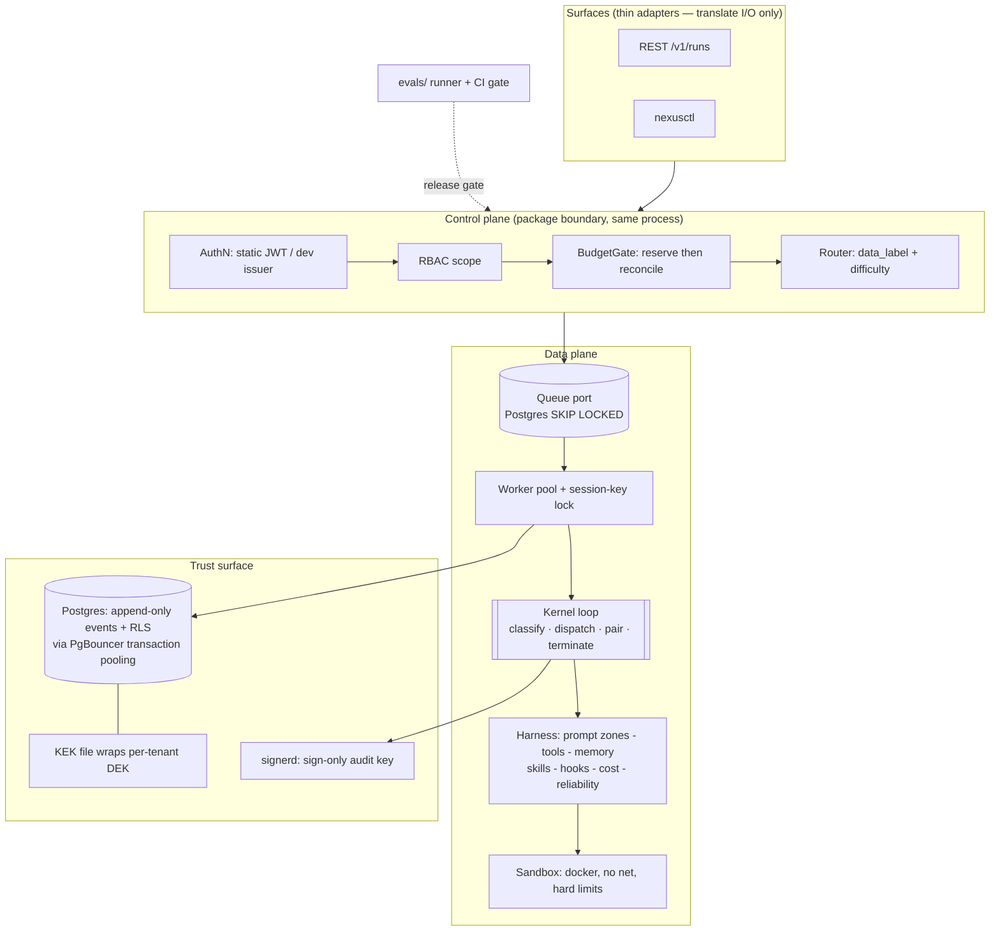

# Nexus Agent Demo

A **simplified, single-binary Go reimplementation** of
[`truongpx396/nexus-agent`](https://github.com/truongpx396/nexus-agent) that still exercises **every core pattern** of the original design.

**Target**: Go, one binary (`nexusd`) + one CLI (`nexusctl`), Postgres + PgBouncer + Redis,
Docker-based sandbox. ~11 phases, ~7–9 weeks solo at a steady pace, every phase shippable.

---

## 1. What the original is, in one page

Two governing equations drive everything:

```
Reliability      ≈ Model capability × Harness quality      (harness ≈ 80% of quality)
Enterprise-ready ≈ Harness quality  × Trust surface        (security + governance + observability)
```

Five architectural strata, connected by hard contracts:

| Stratum | Job | Non-negotiable property |
|---|---|---|
| **Surfaces** | CLI / REST / chat / web / email / cron / Telegram / Zalo / agent-ingress | Thin translators. Zero control flow. Declare a capability descriptor. |
| **Control plane** | AuthN (per-tenant OIDC), RBAC, rate limits, budgets, routing | Deterministic, auditable. Separately deployable behind a versioned contract. |
| **Data plane** | Durable queue → stateless worker → kernel loop → harness → sandbox | All state externalized. Can move into a customer VPC by configuration. |
| **Kernel** | `observe → think → act`, one async generator | Typed response classification; typed terminal reason; paired `tool_use`/`tool_result`. |
| **Trust surface** | RLS, vault, envelope encryption, hash-chained audit, content-free telemetry, approval, sandbox, Rule of Two | Day-one, co-equal perimeter controls — never a retrofit. |

The nine constitutional principles, compressed:

1. **One loop, many surfaces** — no per-surface control-flow fork.
2. **Immutable models, append-only state** — the event log is the only mutable runtime state.
3. **Cache-stable context is architecture** — byte-stable prefix + volatile tail, >90% cache-read.
4. **Stop on cost, not vibes** — pre-spend reservation, hard ceilings, `cost_exhausted`.
5. **Safety is per-invocation and fails closed** — parsed input, layered defense, Rule of Two.
6. **Tenant first; audit + observability day one** — RLS with transaction-local scope, hash-chained receipts, content-free telemetry.
7. **Model/provider-agnostic by abstraction** — one provider port, native tool calling, deterministic routing.
8. **Classify, resume, never silently retry** — typed failure classes, durable checkpoints, circuit break.
9. **Verify against acceptance criteria; govern every change** — evals as the release gate, before the first behavior-bearing slice.

---

## 2. The simplification thesis

The original's own MVP cut line states the rule this plan inherits verbatim:

> **Seams and schema decisions are made early because they are expensive to retrofit;
> infrastructure is added late because it is cheap to add and expensive to carry.**

So the demo keeps **every seam, every contract, and every control**, and collapses only
**deployment topology, scale-out infrastructure, and the commercial/compliance tail**.

Concretely, three collapses:

| Collapse | Original | Demo | Why it's honest |
|---|---|---|---|
| **Deployment** | 3 Go binaries (`control-plane`, `runtime-worker`, `surface-gateway`) + Python helper + React app | 1 binary `nexusd` (+ `nexusctl` CLI, + `signerd` for key custody) | The control↔data-plane split stays a **Go interface** (`controlplane.Port`) with a versioned request/response shape, and the packages never import across the boundary. Splitting into processes later is a `main.go` change, not a rewrite. |
| **Infrastructure** | NATS JetStream, gVisor/Kata warm pool, S3, KMS/HSM, external vault, PgBouncer, OTel collector, pgvector | Postgres (queue via `SKIP LOCKED`), Docker sandbox (no warm pool), local blob dir, file-backed KEK + `signerd`, PgBouncer (kept — it's load-bearing), stdout OTLP | Each sits behind a port with one adapter. The original's own cut line defers exactly these. **PgBouncer is kept** because the transaction-local RLS rule is meaningless without a transaction pooler to prove it against. |
| **Commercial + compliance tail** | Credit ledger, billing periods, FX, price overrides, multi-region residency, BYOK, chargeback export, MCP/OAuth connectors, Telegram/Zalo, document conversion, retrieval tier, adversarial scan, adaptation proposals | Dropped (columns kept where they're schema seams) | These are business processes, not patterns. Dropping them removes ~60 of 191 FRs and zero architectural ideas. |

Everything else — the kernel, the pipeline, the permission chain, the approval transaction,
the audit chain, the erasure model, the cost gate, the orchestration plane, delegation,
the eval gate — ships **in full**, because each *is* the pattern.

---

## 3. Pattern coverage map

Legend: **F** = full fidelity · **S** = simplified but structurally identical · **K** = seam/schema kept, behavior deferred · **✗** = out of scope.

| # | Pattern (original) | Demo | Where it lands | Note |
|---|---|---|---|---|
| 1 | Single kernel loop, async generator | **F** | `kernel/` via Go 1.23 `iter.Seq2` range-over-func | The generator seam survives translation exactly |
| 2 | Typed response classification (`TOOL_CALLS`/`CONTENT`/`EMPTY`) | **F** | `kernel/classify.go` | `exhaustive` linter enforces the switch |
| 3 | Nine typed terminal reasons + a named producer for each | **F** (8 of 9) | `kernel/terminal.go` | `credit_exhausted` dropped with the billing plane |
| 4 | Paired `tool_use`/`tool_result` invariant, synthetic on every error path | **F** | `kernel/hygiene.go` + property test | Property-based over generated histories, as the constitution requires |
| 5 | Append-only event log, versioned envelope, upcasting path | **F** | `internal/store/`, `migrations/` | 40+ event types, `schema_version`, upcast registry |
| 6 | Projections are never a second source of truth | **F** | `internal/store/project.go` | `status`, `terminal_reason`, `taint_state` rebuilt by replay; test asserts rebuild == stored |
| 7 | Two-zone cache-stable prompt + measured cache-read | **F** | `internal/promptctx/` | Byte-equality test on the prefix across turns |
| 8 | Non-destructive live pruning, then structured compaction | **S** | `internal/promptctx/prune.go`, `condense.go` | Condenser is a cheaper model through the same Provider port, not a Python service |
| 9 | Provider port + normalized stream + usage split by token class | **F** | `internal/provider/` | Anthropic adapter + deterministic fake |
| 10 | Deterministic recorded/fake provider (mandatory) | **F** | `internal/provider/fake/` | Scripts truncation, stall, malformed stream, throttle, failover |
| 11 | Deterministic routing by data label + difficulty | **F** | `internal/provider/router.go` | Decision + reason persisted on the session |
| 12 | Failover taxonomy (retryable / permanent / context-overflow) + commit point | **F** | `internal/provider/failover.go` | Once first chunk emitted, the stream is committed |
| 13 | Qualified tool identity `{ns}/{name}@{ver}`, one owner per namespace | **F** | `internal/tools/identity.go` | Collision refused at admission, never by registration order |
| 14 | Catalog manifest pins the *resolvable* universe into `harness_digest` | **F** | `internal/tools/manifest.go` | Deferred disclosure ships as a manifest even with a small resident catalog |
| 15 | Descriptor admission scan + digest re-verification at use | **F** | `internal/tools/admit.go` | Injection scan on descriptors; step 1a re-verify |
| 16 | The single execution pipeline (16 ordered steps) | **F** | `internal/tools/pipeline.go` | Every step present, in order, individually tested |
| 17 | The 10-layer permission resolution order | **F** | `internal/permissions/chain.go` | Total order; table-driven test over all layer combinations |
| 18 | Autonomy as a one-way ratchet | **F** | `internal/permissions/autonomy.go` | No widening operation exists on any interface |
| 19 | Tool profiles (Gate 1) as versioned tenant config | **F** | `internal/permissions/profile.go` | Never resolves `ALLOW` |
| 20 | Per-invocation hybrid safety classifier (rules → model, fail closed to ASK) | **F** | `internal/permissions/safety/` | Model leg has bounded timeout + circuit breaker |
| 21 | Rule of Two over declared taint legs + session taint state | **F** | `internal/permissions/ruleoftwo.go` | Taint transitions are events; only an operator re-baseline clears the untrusted leg |
| 22 | Hook layer (`pre_tool_use`/`post_tool_use`), tighten-only, three handlers | **F** | `internal/hooks/` | `command` + `http` (SSRF-guarded) + `prompt`; chain budget, decision cache, `hook_stopped` |
| 23 | Approval as a **transaction** bound to a canonical digest | **F** | `internal/oversight/approval.go` | `granted_modified`, `approval_mismatch`, expiry-as-denial, invalidate-with-run |
| 24 | Input requests (agent→human pull), zero authorization value | **F** | `internal/oversight/input.go` | Distinct lifecycle + distinct terminal reason |
| 25 | Write-ahead idempotency claim, resolved by probe or human | **F** | `internal/store/claims.go` | Claim `in_flight` **before** the effect leaves the process |
| 26 | Condensation / Checkpoint / Snapshot as three artifacts | **F** | `internal/store/` | Test: a condensation cannot answer "did the payment go out" |
| 27 | Replay / resume / fork as three named operations | **F** | `internal/runctl/` | `replay` is pure; `fork` disables external effects |
| 28 | `harness_digest` pins behavior; divergence reported on fork | **F** | `internal/harness/digest.go` | Pinned at run start, never moves mid-run |
| 29 | Tenant-first RLS with **transaction-local** scope | **F** | `migrations/`, `internal/store/tenant.go` | `set_config('app.tenant_id', $1, true)` — the only scoping call |
| 30 | Isolation test executed **through the pooler** | **F** | `tests/integration/isolation_test.go` | Runs against PgBouncer :6432 in transaction-pooling mode |
| 31 | Hash-chained audit receipts, sign-only key custody, external anchor, scheduled verifier | **F** | `internal/audit/`, `cmd/signerd/` | `signerd` holds the key over a unix socket; `nexusd` can sign, never read |
| 32 | Per-tenant envelope encryption + crypto-shredding erasure | **F** | `internal/crypto/` | Erasure destroys the DEK; `payload_digest` survives; chain still verifies |
| 33 | Derived artifacts hard-deleted in the same erasure transaction | **F** | `internal/crypto/shred.go` | Reconciliation job proves no derived row outlived its source |
| 34 | Content-free telemetry: deny-by-default attribute allowlist, no admitting flag | **F** | `internal/obs/allowlist.go` | Exporter-side filter + a test that tries every content key |
| 35 | Content access grant: audited, expiring, receipt per read | **F** | `internal/obs/grant.go` | The only path to plaintext outside the run's own audience |
| 36 | Turn-scoped spans derived from the log + bidirectional join key | **S** | `internal/obs/spans.go` | Emitted per turn from durable events; exporter is stdout OTLP |
| 37 | Cost: token classes, versioned price book, reserve→reconcile, epoch-marked counter | **F** | `internal/cost/` | Redis Lua reserve; epoch mismatch fails closed |
| 38 | `Money` as exact integers + explicit currency, rounding once | **F** | `internal/cost/money.go` | No binary float anywhere in the path |
| 39 | `budget_decision` for every gate resolution, including `skip` | **F** | `internal/cost/gate.go` | An unenforced ceiling is visibly distinct from a ceiling with room |
| 40 | Every model call metered — including compaction, safety leg, judge, titles | **F** | `internal/cost/meter.go` | "Off the paying loop" = cheaper model, never unmetered |
| 41 | Durable queue + session-key serial lock + stateless workers | **S** | `internal/queue/` | Port + Postgres `SKIP LOCKED` adapter; Redis lock on `session_key` |
| 42 | Typed failure classification, logged backoff+jitter, circuit break at 3 | **F** | `internal/reliability/` | Silent retry is impossible by construction |
| 43 | Stuck detection escalating from `stuck_suspected` to terminate | **F** | `internal/reliability/stuck.go` | Second corroborating trip terminates |
| 44 | Sandbox: hard CPU/mem/PID/wall limits, network default-deny | **S** | `internal/sandbox/` | Docker + `--network none` + rlimits; `isolation` field carries `gvisor`/`kata` as unshipped values |
| 45 | In-sandbox broker = the only route from sandbox code to a tool | **S** | `internal/sandbox/broker.go` | Optional Phase 8 stretch; until then connectors are in the egress deny set (the original's own interim posture) |
| 46 | File-first memory, injected at session start, injection-screened, retention-bounded | **F** | `internal/memory/` | Writes take effect next session (cache stability) |
| 47 | Skills as signed content-addressed bundles, 3-tier disclosure | **F** | `internal/skills/` | `bundle_digest`, per-file scan, `declared_tool_ids` **intersects** |
| 48 | A skill's script is a tool or the bundle is refused | **F** | `internal/skills/admit.go` | No execution path for attachment-borne code |
| 49 | Surfaces: capability descriptor, per-turn principal, conversation binding | **F** | `internal/surfaces/` | Two surfaces (REST, CLI) prove Principle I |
| 50 | Delivery outbox — event appended **before** the send | **F** | `internal/surfaces/outbox.go` | `failed_permanent` stays distinguishable from unanswered |
| 51 | Audience-gated run output (content for the run's own audience) | **F** | `internal/surfaces/project.go` | Distinct signal class from telemetry; withheld ≠ empty |
| 52 | Declarative orchestration plane, zero-token routing | **F** | `internal/plan/` | Predicates are a **closed JSON AST**, not a string language |
| 53 | Plan lifecycle gates: validate → eval → sign-off → pin | **F** | `internal/plan/lifecycle.go` | Oversight-completeness validation included |
| 54 | Delegation: scope descends, taint ascends, bounded, envelope-reserved | **F** | `internal/delegate/` | Delegation is a tool invocation through the same pipeline |
| 55 | Chain attribution (`root`/`parent`/`depth`) on every row | **F** | schema-wide | Foundational columns, written even before delegation ships |
| 56 | Eval gate: k trials, exact intervals, three-valued verdict, suite classes | **F** | `evals/` | `inconclusive` never resolves to `pass` |
| 57 | `eval_environment_digest`, cold sandboxes per trial | **F** | `evals/digest.go` | Refuses to compare across digests |
| 58 | Code graders first, judge as last resort, held-out gap measured | **F** | `evals/grader/` | Judge is cross-family and calibration-gated |
| 59 | Efficiency gated alongside quality | **F** | `evals/efficiency.go` | Tokens/turns/tool-calls bands block a regression |
| 60 | Trajectory grading, not only end state | **F** | `evals/trajectory.go` | Tool-selection accuracy, ask-vs-guess, turns consumed |
| 61 | Config-not-forks onboarding | **F** | `internal/config/` | Tenant/agent/profile/policy are DB rows + markdown bootstrap |
| 62 | Control↔data-plane versioned contract | **K** | `internal/controlplane/` | Interface + `v1` shapes + import-boundary test; one process |
| 63 | Integration ports + authority boundary | **K** | port interfaces only | No third-party adapters — the state the original calls "must keep working forever" |
| 64 | MCP client, per-user OAuth connectors, Telegram/Zalo, email, cron, web UI | **✗** | — | Surface *pattern* proven by REST + CLI; these add no new idea |
| 65 | Credit ledger, billing periods, FX, price overrides, chargeback | **✗** | — | Commercial process, not architecture |
| 66 | Multi-region residency, BYOK, four-topology packaging, rainbow deploy | **✗** | — | `region` and `key_id` columns kept as seams |
| 67 | Retrieval/pgvector tier, document conversion, adversarial scan, adaptation proposals | **✗** | — | Each gated on a trigger the demo never reaches |

**Score: 55 of 67 patterns at full or simplified fidelity, 4 as seams, 8 deliberately out.**
Every omission is a deployment, commercial, or connector concern — no architectural idea is dropped.

One addition sits outside this count: peer agent teams (Phase 9) — shared task boards with
Kanban-style claiming. It is not a simplification of anything in the original's 67; it is new
scope, added after the fact and scoped tightly (fixed roster, shared budget envelope, read-time
taint propagation) so it reuses this plan's existing primitives instead of adding a second set of
rules alongside them.

---

## 4. Target architecture of the demo



### Repository layout

```text
nexus-agent-demo/
├── cmd/
│   ├── nexusd/                 # the single binary: control plane + worker pool + REST surface
│   ├── nexusctl/               # CLI surface adapter — the second surface that proves Principle I
│   └── signerd/                # sign-only audit-chain key custody over a unix socket
├── kernel/                     # THE LOOP — no imports from internal/surfaces or internal/controlplane
│   ├── loop.go                 # iter.Seq2[Event,error] generator; the only control flow in the system
│   ├── classify.go             # TOOL_CALLS | CONTENT | EMPTY
│   ├── terminal.go             # the 8 typed terminal reasons + their producers
│   └── hygiene.go              # pre-call pass: orphan drop, synthetic backfill, stale prune
├── internal/
│   ├── provider/               # port + normalized stream + anthropic/ + fake/ + router + failover
│   ├── tools/                  # identity, manifest, admission, registry, pipeline (16 steps), builtin/
│   ├── permissions/            # the 10-layer chain, autonomy ratchet, profiles, safety/, ruleoftwo
│   ├── hooks/                  # dispatcher + command|http|prompt handlers + bounding guards
│   ├── oversight/              # approvals + input requests over one durable-suspend mechanism
│   ├── promptctx/              # two-zone builder, cache measurement, pruning, condensation
│   ├── memory/                 # file-first, screening, retention
│   ├── skills/                 # bundles, digests, 3-tier disclosure, capability intersection
│   ├── cost/                   # money, meters, price book, reserve/reconcile, budget decisions
│   ├── audit/                  # chain builder, signer client, verifier, anchor
│   ├── crypto/                 # KEK/DEK envelope, seal/open, shred, derived-artifact reconcile
│   ├── store/                  # events, projections, checkpoints, snapshots, claims, RLS scoping
│   ├── queue/                  # Queue port + postgres adapter + session-key lock
│   ├── reliability/            # classifier, backoff, breaker, stuck detector
│   ├── runctl/                 # steer, cancel, resume, replay, fork, tightenAutonomy
│   ├── sandbox/                # docker exec, limits, deny-net, (optional) broker
│   ├── plan/                   # orchestration plane: schema, validator, predicate AST, evaluator
│   ├── delegate/               # sub-agent seam (a tool invocation, not a side channel)
│   ├── surfaces/               # rest/, cli/, capability descriptors, principal resolution, outbox
│   ├── obs/                    # allowlisted attributes, log-derived spans, content-access grants
│   ├── harness/                # harness_digest computation
│   ├── config/                 # tenant/agent/profile/policy loading — config, never forks
│   └── controlplane/           # the versioned CP<->DP contract as Go interfaces + local impl
├── migrations/                 # numbered SQL, expand/contract discipline, RLS policies
├── evals/                      # corpus/*.yaml, runner, graders, judge, digest, CI gate
├── deploy/
│   ├── docker-compose.yml      # postgres, pgbouncer(:6432, transaction pooling), redis
│   └── sandbox/Dockerfile      # the hardened exec image
├── tests/
│   ├── contract/               # kernel ABI, control/data-plane, run-API
│   ├── integration/            # isolation-through-pooler, resume, ceiling, HITL, erasure
│   └── property/               # paired-result invariant over generated histories
├── docs/                       # design notes; diagrams mirrored from the source repo
└── PLAN.md                     # this file
```

**Import boundary rule (enforced by a test, not a convention):**
`kernel/` may import `internal/{provider,tools,promptctx,store,cost,reliability,obs}` and nothing else.
`internal/surfaces/` may not import `kernel/`. `internal/controlplane/` may not import
`internal/{sandbox,memory,provider}`. A `tests/contract/boundaries_test.go` walks the import
graph with `go/packages` and fails the build on a violation — this is what keeps the
"physical split later is a deployment change" claim true.

### Core schema (the part that cannot be retrofitted)

```sql
-- Every tenant-scoped table carries tenant_id and an RLS policy. No exceptions.
CREATE TABLE events (
  event_id        uuid PRIMARY KEY,
  session_id      uuid NOT NULL,
  tenant_id       uuid NOT NULL,
  seq             bigint NOT NULL,
  schema_version  int  NOT NULL,             -- envelope version; upcasting path documented
  type            text NOT NULL,             -- the ~40-type taxonomy
  payload         bytea,                     -- AES-256-GCM ciphertext under the tenant DEK
  payload_digest  bytea NOT NULL,            -- over PLAINTEXT; survives crypto-shredding
  key_id          text NOT NULL,             -- destroying this key IS erasure
  actor           text NOT NULL,             -- model | tool | user | system
  tool_id         text,                      -- {namespace}/{name}@{version}
  pair_ref        uuid,                      -- tool_result -> tool_use  (THE invariant)
  model_id        text,
  trace_id        bytea, span_id bytea,      -- the bidirectional join key
  created_at      timestamptz NOT NULL DEFAULT now(),
  UNIQUE (session_id, seq)
);
ALTER TABLE events ENABLE ROW LEVEL SECURITY;
CREATE POLICY events_tenant ON events
  USING (tenant_id = current_setting('app.tenant_id', true)::uuid);
-- events are append-only: no UPDATE/DELETE grant to the app role, enforced by a trigger too.

CREATE TABLE sessions (
  session_id uuid PRIMARY KEY, session_key text NOT NULL, tenant_id uuid NOT NULL,
  surface_id text NOT NULL, user_id uuid NOT NULL, audience_ref text,
  agent_id uuid NOT NULL, agent_version int NOT NULL,        -- pinned at run start
  harness_digest bytea NOT NULL,                             -- pins ALL behavior-bearing config
  forked_from_session_id uuid, fork_seq bigint, fork_overrides jsonb,
  data_label text NOT NULL, route_model_id text NOT NULL, route_reason jsonb NOT NULL,
  execution_class text NOT NULL, priority int NOT NULL, region text NOT NULL,
  parent_session_id uuid, root_session_id uuid NOT NULL, depth int NOT NULL DEFAULT 0,
  delegation_role text NOT NULL DEFAULT 'root',
  plan_id uuid, plan_version int,
  taint_state jsonb NOT NULL,        -- PROJECTION
  status text NOT NULL,              -- PROJECTION
  autonomy_level text NOT NULL,      -- pinned, ratcheting
  terminal_reason text,              -- PROJECTION
  active_ms bigint NOT NULL DEFAULT 0, suspended_ms bigint NOT NULL DEFAULT 0,
  created_at timestamptz NOT NULL DEFAULT now()
);
```

Plus, all with `tenant_id` + RLS: `checkpoints`, `snapshots`, `idempotency_claims`,
`approvals`, `input_requests`, `audit_receipts`, `audit_anchors`, `encryption_keys`,
`cost_records`, `budgets`, `budget_reservations`, `budget_decisions`, `price_book`,
`tools`, `tool_profiles`, `catalog_manifests`, `effect_classes`, `approval_policies`,
`skills`, `skill_bundle_files`, `memories`, `derived_artifacts`, `sandboxes`,
`surfaces`, `surface_identities`, `delivery_records`, `delegations`,
`orchestration_plans`, `content_access_grants`, `queue_jobs`.

~32 tables. The original has ~50; the 18 dropped are billing, FX, connectors, integration
adapters, and the eval entities (which live in `evals/` as files here, not rows).

**Tenant scoping — the only sanctioned form:**

```go
// internal/store/tenant.go — every read/write path goes through this. No exceptions.
func (s *Store) InTenantTx(ctx context.Context, tenantID uuid.UUID, fn func(pgx.Tx) error) error {
    return pgx.BeginFunc(ctx, s.pool, func(tx pgx.Tx) error {
        // transaction-local, parameterised. SET LOCAL cannot take a parameter; set_config(.., true) can.
        if _, err := tx.Exec(ctx, `SELECT set_config('app.tenant_id', $1, true)`, tenantID.String()); err != nil {
            return err
        }
        return fn(tx)
    })
}
```

Session-level `SET` is banned by a lint rule *and* by the isolation test running through
PgBouncer in transaction-pooling mode — the whole point being that a connection is
reassigned between tenants between statements.

### Key interfaces (the kernel ABI, translated to Go)

```go
// kernel/loop.go — the generator. This is the ONLY place control flow lives.
type Kernel interface {
    Run(ctx context.Context, s *Session) iter.Seq2[Event, error]
}

// internal/provider — one abstraction, native tool calling only, usage split by class.
type Provider interface {
    Stream(ctx context.Context, p Prompt, tools []ToolSchema, rc RunContext) (Stream, error)
}
type Chunk struct {
    Kind      ChunkKind // content | reasoning | tool_use | usage | done
    Text      string
    Opaque    []byte    // reasoning: round-tripped, never shown
    ToolUseID, ToolName string
    Input     json.RawMessage
    Usage     Usage     // InputUncached, InputCacheRead, InputCacheWrite, Output
    Done      DoneReason // stop | max_output | error
}

// internal/tools — self-describing; every field of Taint defaults to TRUE.
type Tool interface {
    ID() ToolRef                         // {namespace}/{name}@{version}
    Descriptor() Descriptor              // description, schemas, digest, disclosure, effect class
    Taint() Taint                        // returns_untrusted, reads_private_data, mutates_external
    IsConcurrencySafe(input json.RawMessage) bool   // PER INVOCATION, default false
    CheckPermissions(ctx context.Context, in json.RawMessage, rc RunContext) PermissionResult
    ValidateInput(ctx context.Context, in json.RawMessage, rc RunContext) error
    Call(ctx context.Context, in json.RawMessage, rc RunContext) (Result, error)
}

// internal/cost — called BEFORE every Provider.Stream, including auxiliary calls.
type BudgetGate interface {
    Reserve(ctx context.Context, r ReserveReq) (Reservation, error) // -> cost_exhausted on refusal
    Reconcile(ctx context.Context, id ReservationID, u Usage) error // accepts UNREPORTED
    Record(ctx context.Context, m MeterID, qty int64, ref string) error
}

// internal/oversight — approval and elicitation share suspension and nothing else.
type Oversight interface {
    RequestApproval(ctx context.Context, r ApprovalRequest, rc RunContext) (ApprovalOutcome, error)
    RequestInput(ctx context.Context, r InputRequest, rc RunContext) (InputOutcome, error)
    Invalidate(ctx context.Context, sessionID uuid.UUID, reason InvalidationReason) error
}

// internal/store — one log, three artifacts that are never interchangeable.
type Persistence interface {
    Append(ctx context.Context, e Event) (Seq, error)
    Checkpoint(ctx context.Context, sessionID uuid.UUID) (CheckpointID, error) // machine-facing resume
    Snapshot(ctx context.Context, sessionID uuid.UUID, at Seq) (SnapshotID, error) // disposable
    Hydrate(ctx context.Context, sessionID uuid.UUID) (SessionState, error)
    Claim(ctx context.Context, key string, pairRef uuid.UUID) (Claim, error)  // WRITE-AHEAD
    ResolveClaim(ctx context.Context, id ClaimID, r Resolution) error         // never re-executes
}

// internal/controlplane — the versioned boundary. One process today, two later.
type Port interface { // v1
    AdmitRun(context.Context, AdmitRunV1) (AdmitRunResultV1, error)
    ReserveBudget(context.Context, ReserveBudgetV1) (ReserveBudgetResultV1, error)
    ReportCost(context.Context, ReportCostV1) error
    EmitAuditReceipt(context.Context, EmitAuditReceiptV1) error
    RequestApproval(context.Context, RequestApprovalV1) (RequestApprovalResultV1, error)
    AuthorizeContentAccess(context.Context, AuthorizeContentAccessV1) (GrantV1, error)
}
```

### The permission chain, verbatim from the original

```go
// internal/permissions/chain.go — one published TOTAL order. Every invocation walks it.
//  1  Deny rules (tenant/tool/pattern)  -> DENY (final)
//  2  PreToolUse hooks                  -> DENY (final) | ASK | DEFER      (never ALLOW)
//  3  Autonomy level (pinned, ratchet)  -> DENY | ASK | DEFER
//  4  Gate 1: tool profile membership   -> DENY | DEFER                    (never ALLOW)
//  5  Gate 2: capability metadata       -> DENY | ASK | DEFER
//  6  Gate 3: per-invocation safety     -> DENY | ASK | DEFER   ALWAYS EVALUATED
//  7  Rule of Two (taint + declaration) -> ASK  | DEFER          ALWAYS EVALUATED
//  8  Approval policy                   -> AUTO | ASK(once|session|multi_party)
//  9  Standing scope / batch / preauth  -> SATISFIES an ASK      (never suppresses one)
// 10  Otherwise                         -> ALLOW
//
// Two invariants make the order load-bearing rather than decorative:
//   - a DENY at any layer is final; there is no bypass mode in this system.
//   - layers 6 and 7 are unconditional; a remembered "yes" answers a question,
//     it never grants permission to stop asking it.
// Skills sit BELOW this table as an intersection pre-filter, never as a layer —
// a layer could resolve ALLOW, and "load this skill" must never widen anything.
```

---

## 5. Build phases

Eleven phases. Each is independently shippable and ends with a **demo command** you can run and
an **acceptance test** that must be green. Sizing assumes one developer; parallelisable work
is marked `[P]`.

### Phase 0 — Setup (1 day)

| # | Task | File(s) |
|---|---|---|
| 0.1 | `go mod init github.com/truongpx396/nexus-agent-demo`; Go toolchain pinned in `go.mod` | `go.mod` |
| 0.2 | `docker-compose.yml`: postgres:17, pgbouncer (**transaction pooling**, :6432), redis:7 | `deploy/docker-compose.yml` |
| 0.3 | `golangci-lint` with `exhaustive`, `errcheck`, `gosec`, `forbidigo` (ban `SET app.tenant_id`, ban `float64` in `internal/cost`) | `.golangci.yml` |
| 0.4 | `Makefile`: `up`, `migrate`, `seed`, `run`, `test`, `eval`, `verify-chain` | `Makefile` |
| 0.5 | CI: build → lint → unit → integration (testcontainers) → **eval gate** | `.github/workflows/ci.yml` |
| 0.6 | Copy the constitution into `docs/constitution.md` — it is the review checklist | `docs/` |

**Acceptance**: `make up && make test` green on an empty test suite; `golangci-lint run` clean.

---

### Phase 1 — Foundational seams (5–6 days) ⚠️ blocking

> Everything here is a *schema or contract* decision. The original's cut line exists because
> each of these is expensive-to-impossible to retrofit onto a log that already has rows in it.

| # | Task | Proves |
|---|---|---|
| 1.1 | Migrations: `events` (with `schema_version`, `payload_digest`, `key_id`, `pair_ref`, `trace_id`/`span_id`), `sessions` (with `harness_digest`, fork columns, `root/parent/depth`, `plan_id`) | FR-006, FR-086, FR-119, FR-128, FR-129, FR-101 |
| 1.2 | RLS policies on every tenant table + append-only trigger on `events` (no UPDATE/DELETE) | Principle VI |
| 1.3 | `store.InTenantTx` — transaction-local scope, the only scoping call in the codebase | FR-039 |
| 1.4 | `[P]` **Isolation test through PgBouncer**: two tenants, interleaved statements on a pooled connection, cross-read must fail | FR-039 — the test that makes the claim real |
| 1.5 | Event taxonomy (~40 types) + envelope upcasting registry + a v0→v1 upcast test | FR-085, FR-086 |
| 1.6 | `crypto`: KEK from file → per-tenant DEK, AES-256-GCM seal/open, `payload_digest` over plaintext | FR-080, FR-089 |
| 1.7 | `obs`: deny-by-default attribute allowlist + a span exporter that drops unlisted keys | FR-117 |
| 1.8 | `[P]` `provider/fake`: YAML-scripted deterministic provider incl. truncation, stall, malformed stream, throttle | FR-097 — **mandatory** |
| 1.9 | `[P]` `evals/`: corpus loader, runner skeleton, code graders, CI gate wired to fail the build | Principle IX — **before the first behavior-bearing slice** |
| 1.10 | `harness.Digest()` over (system-prompt version, catalog manifest, skill set, safety policy, approval policy, prompt mode) | FR-129 |
| 1.11 | `tests/contract/boundaries_test.go` — import-graph assertions for the CP/DP split | Delivery constraint |

**Demo**: `make migrate && make seed TENANT=acme` prints *"RLS enabled on 32/32 tenant tables;
tenant scope is transaction-local"*.
**Acceptance**: 1.4 fails loudly if you change `set_config(...,true)` to `set_config(...,false)`.
That single-character sensitivity is the point of the phase.

---

### Phase 2 — The kernel loop (5 days) 🎯 first behavior-bearing slice

| # | Task | Proves |
|---|---|---|
| 2.1 | `kernel/loop.go` — `iter.Seq2[Event,error]` generator: hygiene → reserve → stream → classify → dispatch → pair → terminate | FR-001, FR-002 |
| 2.2 | `kernel/classify.go` — typed union, dispatch on classification, never on text | FR-002 |
| 2.3 | `kernel/terminal.go` — 8 reasons, each with a **named producer**; `exhaustive` linter on every switch | FR-004 |
| 2.4 | `kernel/hygiene.go` — drop orphan results, backfill synthetic results, prune stale observations | FR-060 |
| 2.5 | **Property test**: over generated event histories, every `tool_use` has exactly one `tool_result` before the next model call | FR-003, FR-097 |
| 2.6 | `promptctx`: two-zone builder — byte-stable prefix (stable system prompt + sorted resident catalog + append-only transcript) vs. volatile tail | FR-013 |
| 2.7 | **Prefix byte-equality test** across N turns + cache-read rate computed from recorded per-class token counts | FR-014, SC-003 |
| 2.8 | `provider`: port + normalized stream + Anthropic adapter + `router.go` (data label × difficulty, decision persisted) | FR-027, FR-037 |
| 2.9 | `provider/failover.go`: typed trigger taxonomy; **committed after first chunk**; never fail over on context overflow | FR-167 |
| 2.10 | REST surface: `POST /v1/runs`, `GET /v1/runs/{id}`, `GET /v1/runs/{id}/events` (SSE, audience-gated) | FR-031, FR-191 |

**Demo**: `curl -X POST localhost:8080/v1/runs -d '{"input":"..."}'` → `202`, then SSE streams
`content` / `tool_use` / `tool_result` / `terminal`.
**Acceptance**: kill the process mid-turn; the log still shows a paired result for every
`tool_use`. Change one byte of the system prompt mid-session in a test — the prefix test fails.

---

### Phase 3 — Tool pipeline + permission chain + hooks (7–8 days)

This is the densest phase and the one that most defines the platform.

| # | Task | Proves |
|---|---|---|
| 3.1 | `tools/identity.go` — `{ns}/{name}@{ver}`, one owner per namespace, **collision refused at admission** (never by registration order) | FR-147 |
| 3.2 | `tools/manifest.go` — catalog manifest pins the *resolvable* universe into `harness_digest`; `tool_loaded` lands in the volatile zone | FR-148 |
| 3.3 | `tools/admit.go` — descriptor injection scan (`pending` → `clean` / `flagged` / `rejected`, fail closed) | FR-113 |
| 3.4 | `tools/pipeline.go` — the 16 ordered steps, each individually unit-tested | FR-007, FR-010 |
| 3.5 | Canonical digest (RFC 8785 JCS over `digest_fields`) — **one artifact, three jobs**: approval binding, idempotency key, step-9a re-verification | FR-103, FR-071 |
| 3.6 | `permissions/chain.go` — the 10-layer total order; table-driven test over the layer cross-product | FR-111 |
| 3.7 | `permissions/autonomy.go` — pinned ratchet; assert **no widening function exists** on any exported surface | FR-111 |
| 3.8 | `permissions/profile.go` — Gate 1, versioned tenant config, resolves only DENY/DEFER | FR-176 |
| 3.9 | `permissions/safety/` — hybrid: deterministic rule pass in-process, then a model leg with bounded timeout, **fail closed to ASK**, circuit breaker | FR-009, FR-116 |
| 3.10 | `permissions/ruleoftwo.go` — taint legs default TRUE; session taint state as a projection; `taint_transition` events; only an operator re-baseline clears the untrusted leg | FR-033, FR-087 |
| 3.11 | `hooks/` — dispatcher, `command`/`http`(SSRF-guarded)/`prompt` handlers, matcher + JSON-AST `if_expr`, per-hook timeout (default `block`), chain budget, per-turn cap, decision cache, `updatedToolInput` through a path allowlist that **re-binds the digest** | FR-171, FR-166 |
| 3.12 | Builtin tools: `platform/file_read`, `file_write`, `file_search`, `shell`, `web_fetch` — each with a taint declaration and an effect class | FR-056–FR-059 |
| 3.13 | Result budgeting: cap/paginate ~25k tokens, spill to blob dir, return preview + *"do not infer success from the preview"* banner | FR-010 |

**Demo**: `nexusctl run --autonomy read_only "delete the build dir"` → refused at layer 3 with a
typed reason and an audit trail; the same run at `supervised` → suspends on an approval.
**Acceptance**: a test that asserts *"a standing scope cannot cause layer 6 or 7 to be skipped"*,
and a test that a hook returning `ALLOW` is treated as `DEFER`.

---

### Phase 4 — Cost governance (4–5 days)

| # | Task | Proves |
|---|---|---|
| 4.1 | `cost/money.go` — exact integer minor units, explicit currency, declared scale, rounding **once at the asserted boundary**; `forbidigo` bans `float64` in the package | FR-180 |
| 4.2 | `cost/meter.go` — `(meter, quantity, unit)` registry with `reservable` flag; token family emitted, non-token meters registered but unemitted | FR-179 |
| 4.3 | `cost/pricebook.go` — versioned, keyed `(meter, priced subject, effective range)`; historical cost stays reproducible | FR-084, FR-181 |
| 4.4 | `cost/gate.go` — **reserve → stream → reconcile**; Redis Lua atomic counter with an **epoch marker**; unknown epoch = unavailable = fail closed (never "no spend yet") | FR-083, FR-186 |
| 4.5 | Worker-local hard per-run budget enforced synchronously (a ceiling never depends on a round trip) | Delivery constraint |
| 4.6 | `budget_decision` event for every resolution — `allow` / `refuse_ceiling` / `degrade` / `skip` — with reason, resolved scope, deciding budget | FR-188, FR-190 |
| 4.7 | `Reconcile` accepts `UNREPORTED` → reconciles at full reserved worst case, flagged (an unreliable provider must not look free) | FR-185 |
| 4.8 | **Every** model call routed through the gate: compaction, the safety model leg, prompt hooks, the judge, title generation | FR-165 — "off the paying loop" = cheaper model, never unmetered |
| 4.9 | Cost records appended in the same transaction as the turn and shipped through the outbox | FR-124 |

**Demo**: set a $0.05 per-task ceiling → the run terminates `cost_exhausted` **before** the
overspending call, with a `budget_decision` naming the budget that refused.
**Acceptance**: an integration test firing 20 concurrent sessions against one tenant ceiling —
total spend must not exceed the ceiling (this is what post-hoc aggregation cannot deliver).

---

### Phase 5 — Trust surface (8–9 days)

| # | Task | Proves |
|---|---|---|
| 5.1 | `cmd/signerd` — holds the audit key, exposes `Sign(digest)` over a unix socket; `nexusd` can sign but **cannot read** the key | Sign-only custody |
| 5.2 | `audit/chain.go` — receipt per mutating action, hash-chained per session, over **digests** not plaintext (so a lawful redaction never breaks verification) | FR-040, FR-081 |
| 5.3 | `audit/anchor.go` + `audit/verify.go` — periodic head anchoring outside the writing system; scheduled verifier alerting on a break or a sequence gap | FR-081 |
| 5.4 | `crypto/shred.go` — erasure destroys the DEK; **derived artifacts hard-deleted in the same transaction**; reconciliation job proves no derived row outlived its source | FR-080, FR-162 |
| 5.5 | Erasure test: after shredding, the event log still **replays structurally** and the audit chain still **verifies** | The reconciliation of append-only with the right to erasure |
| 5.6 | `oversight/approval.go` — the full transaction: digest binding, decision-ready context package, named assignee, TTL, `granted` / `granted_modified` / `denied` / `expired` / `invalidated` | FR-036, FR-103–FR-108 |
| 5.7 | Step 9a digest re-verification → typed `approval_mismatch`, never a silent re-request | FR-103 |
| 5.8 | Durable suspend at **zero token cost**: checkpoint + evict, resume on the approval event; suspended interval excluded from every latency SLI | FR-036, FR-120 |
| 5.9 | `oversight/input.go` — schema-declared question, `on_expiry` → recorded default assumption or `input_expired`; carries **zero** authorization | FR-110 |
| 5.10 | `Invalidate` on cancel / terminal / reap / ceiling breach / steer-into-suspension, each releasing a paired synthetic result | FR-106 |
| 5.11 | `obs/grant.go` — content-access grant: audited, expiring, hash-chained receipt on grant **and on every read** | FR-118 |
| 5.12 | `sandbox/` — Docker exec, `--network none`, CPU/mem/PID/wall limits, per-session workspace; breach → terminate + reclaim; `isolation` field carries `gvisor`/`kata` as unshipped values | FR-047, FR-059 |
| 5.13 | Egress allowlist for `web_fetch`; connector/MCP endpoints in the sandbox **deny** set (no broker yet — a bypass is never the interim state) | FR-037, FR-149 |
| 5.14 | Adversarial oversight tests: injected attempts to simulate consent, widen autonomy mid-run, reach a gated effect through a standing scope — all must be refused **and audited** | SC-025 |

**Demo**: `nexusctl run "email the Q3 numbers to finance@…"` → suspends; `nexusctl approvals show`
renders recipient/subject/attachment digests (never a bare UUID); modify the recipient at grant
time → the tool executes the **approver's** input and the agent is not told it ran unmodified.
Then substitute an argument after the grant → `approval_mismatch`.
**Acceptance**: 5.5 and 5.14. If either is weak, the trust surface is decoration.

---

### Phase 6 — Reliability & the three state artifacts (5–6 days)

| # | Task | Proves |
|---|---|---|
| 6.1 | `queue/` — port + Postgres `SKIP LOCKED` adapter + admission control; worker pool pulls jobs | FR-046 |
| 6.2 | Session-key serial lock in Redis (per-session serial, cross-session concurrent) | FR-046 |
| 6.3 | `Checkpoint` — covered seq, open claim, held reservation, sandbox handle, pending approval digest, in-flight provider request id, open delegations, `harness_digest` | FR-024, FR-126 |
| 6.4 | `Snapshot` — disposable projection cache; **test: deleting every snapshot changes nothing but hydration time** | FR-126 |
| 6.5 | `Condensation` — model-facing only; **test: a condensation cannot answer whether an external effect completed** | FR-015, FR-130 |
| 6.6 | `claims`: write-ahead `in_flight` **before** the effect leaves the process; `completed` short-circuits; resume resolves by probe or human — **never** by re-execution, never by silent discard | FR-127 |
| 6.7 | `reliability/classifier.go` — typed failure classes before any retry; backoff + jitter **logged with a reason**; circuit break after 3 identical failures | FR-023 |
| 6.8 | `reliability/stuck.go` — repeated action / oscillation / zero net change over K steps → `stuck_suspected` (non-terminal), terminate only on a corroborating second trip | FR-115 |
| 6.9 | `runctl/` — `steer` (drained at a turn boundary under the serial lock; steering into a suspended run invalidates its approval), `cancel` (the sole producer of `aborted`), `resume`, `tightenAutonomy` | FR-005 |
| 6.10 | `replay` — **pure**: no model call, no tool, no append; how projections rebuild and how upcasting is verified | FR-128 |
| 6.11 | `fork` — new run from `at_seq` with declared overrides, external effects **disabled**, inherits no approvals, own budget and audit chain; reports digest divergence rather than presenting it as a reproduction | FR-128, FR-129 |

**Demo**: `kill -9` the worker mid-tool-call → the job re-queues and **resumes from the
checkpoint**, and the in-flight claim is escalated rather than re-executed.
Then `nexusctl fork <session> --at 42 --model haiku` reproduces a failure against a candidate fix.
**Acceptance**: 6.4, 6.5, 6.6 — the three artifacts must be provably non-interchangeable.

---

### Phase 7 — Harness growth: memory, skills, surfaces (5–6 days)

| # | Task | Proves |
|---|---|---|
| 7.1 | `memory/` — file-first per tenant, injected **at session start** (writes take effect next session), injection/exfiltration screening before injection, 90-day retention | FR-019 |
| 7.2 | Memory consolidation as an **ordered, metered, degrade-capable** stage: the durable write precedes the compaction that would discard its source; falls back to a no-model extractive pass at a ceiling | FR-165 |
| 7.3 | `skills/` — signed content-addressed bundle: `bundle_digest` over every file, per-file injection scan, three disclosure tiers (resident metadata → body on activate → per-file reference) | FR-020, FR-151 |
| 7.4 | `declared_tool_ids` **intersects** the resolved catalog, never unions; a non-held entry is ignored and recorded as `skill_capability_ignored` | FR-153 |
| 7.5 | A bundled script registers as a real tool through the ordinary gates **or the bundle is refused** | FR-151 |
| 7.6 | `internal/skills/manifest.go` — tier-1 resident metadata (`skill_id`, description, trigger hint, `declared_tool_ids`) for the tenant's admitted set, folded into `SkillSetDigest` at run start; **no `skill_search` tool** — the catalog is vetted and per-tenant-bounded, not a corpus (seam left for one if that stops being true) | FR-020, build-for-the-stage constraint |
| 7.7 | `internal/tools/builtin/skill.go` — `activate_skill(skill_id)` implements the ordinary `Tool` interface, **no new ABI**: dispatched through the same 16-step pipeline as any tool; its `tool_result` **is** the skill body, extending the byte-stable prefix the way every tool result already does — never a mid-session system-prompt splice, and `kernel/classify.go` needs zero changes (it is just another `TOOL_CALLS` turn) | FR-151 |
| 7.8 | Activation re-checks `declared_tool_ids` against the **currently resolved** catalog, not just what admission saw — tenant config can move between admission and activation; emits `skill_activated` (the live subset) and `skill_capability_ignored` per absent entry, fail closed | FR-153 |
| 7.9 | `read_skill_file(skill_id, path)` — lazy tier-3, reference/template content only, path-allowlisted like any sandboxed file read; a bundled **script** is never fetched this way — it is admitted as its own tool (7.5) and invoked as its own `tool_use` | FR-151 |
| 7.10 | `promptctx/prune.go` — non-destructive live pruning (outlier guard → soft trim → hard clear to a refetchable reference); **never mutates a logged event** | FR-164 |
| 7.11 | `promptctx/condense.go` — structured compaction at ~80% budget on a cheaper model through the same Provider port; metered; blocking-or-not is a **declared, measured** property | FR-015, FR-130 |
| 7.12 | `surfaces/` — capability descriptors (`principal_kind`, can-render-approval-context, step-up, structured input, streaming), conformance test per surface, approval routing **filters on capability** | FR-155 |
| 7.13 | Per-turn principal resolution — authority is the **turn-submitting** principal, never inherited from whoever opened the thread | FR-156 |
| 7.14 | `surfaces/outbox.go` — event appended **before** the send; at-least-once, idempotent on `(session, seq, surface, recipient)`; `failed_permanent` stays distinguishable from unanswered | FR-157 |
| 7.15 | `nexusctl` as a second real surface over the same kernel — zero kernel changes | FR-001 |

**Demo**: submit the same task through REST and through `nexusctl`; both produce identical event
sequences and identical terminal reasons. `git diff kernel/` after adding the CLI is empty.
Separately: activate a skill, then revoke one of its `declared_tool_ids` from the tenant catalog
mid-session and activate again — `skill_capability_ignored` fires, the run continues on the tools
it still holds, and `git diff kernel/` for the whole skills feature is likewise empty.
**Acceptance**: 7.4 (a skill cannot widen capability), 7.7 (skill activation adds no kernel control
flow — it is dispatched, paired, and appended exactly like any other tool call), and 7.15 (the
empty diff).

---

### Phase 8 — Orchestration plane + delegation (6–7 days)

| # | Task | Proves |
|---|---|---|
| 8.1 | `plan/schema.go` — `Plan{steps[], cost_envelope}`, `Step{kind}` ∈ agent / delegate_fanout / approval_gate / preauth / input_request / condition / loop | FR-102 |
| 8.2 | `plan/predicate.go` — a **closed JSON AST** (eq, ne, lt, gt, and, or, in, typed field refs). No string eval, no I/O, no model call, no unbounded loop | The zero-token claim becomes a *property* |
| 8.3 | `plan/validate.go` — schema, reachability, bounded loops, closed predicates, scope-subset proof per step, and **oversight completeness** (a plan that routes around its own tenant's approval policy fails validation) | FR-102 |
| 8.4 | Lifecycle: `draft → validate → eval gate → governance sign-off → enabled`; pins `agent_version` + `route_model_id` at enable; enabled versions immutable; in-flight runs finish on their version | FR-088, FR-096 |
| 8.5 | `plan/exec.go` — platform evaluates transitions; step boundary = checkpoint; `plan_started`/`step_entered`/`transition`/`step_exited`/`plan_completed` events | FR-024, FR-085 |
| 8.6 | **Zero-token routing test** against the fake provider: assert *no* `Provider.Stream` call occurs while evaluating a transition | SC-023 |
| 8.7 | `preauth` step — enumerated, digest-bound set for one human decision; a preauth admitting anything outside its enumeration fails validation | FR-109 |
| 8.8 | `delegate/` — delegation is a **tool invocation through the same pipeline**: paired result, permission chain, audit receipt, all inherited | FR-100 |
| 8.9 | `internal/tools/builtin/delegate.go` — `delegate` implements the ordinary `Tool` interface, **no new ABI**: input `{agent_id, task, scope_grant, return_schema}`; `CheckPermissions` re-derives `scope_grant` as a provable subset of the **parent's own resolved scope** — it is never trusted from the input; `Taint()` defaults all three legs to `TRUE` like every tool, so autonomy level and the Rule of Two gate a delegation call **in addition to**, not instead of, the depth/concurrency/per_run bounds below | FR-100 |
| 8.10 | Delegation suspends on the **same durable-suspend primitive** approvals already use (5.8) — checkpoint + evict, resume on `delegation_returned` / `delegation_reaped` — at zero token cost; no second suspension mechanism is built | FR-100, FR-120 |
| 8.11 | Taint-ascend, made mechanical: a child's `taint_state` **starts as a copy of the parent's** at spawn (it inherits the trust context it was spawned from); on return, the parent's `taint_state` projection folds in the child's **own event-derived** `taint_state` — read from the child's history, never from a claim in its return payload, so a child cannot self-report "clean" | FR-098 |
| 8.12 | Scope descends (provable subset, no widening parameter), taint ascends (a summary never clears the untrusted leg), bounds fail closed (`depth ≤ 1`, `concurrent ≤ 3`, `per_run ≤ 16`) | FR-098, FR-099 |
| 8.13 | Fan-out cost reserved **as an envelope before the first child starts**; children draw from it (per-child reservation against the tenant counter is prohibited). A single ad hoc `delegate` call is not a fan-out — it reserves normally through `BudgetGate.Reserve`; the envelope applies specifically to a `delegate_fanout` plan step, sized for its worst-case child count up front | FR-099 |
| 8.14 | Reaping on parent terminal/cancel/ceiling; return-schema validation + acceptance criterion before folding in; `bound_exceeded` is **non-retryable** | FR-100 |
| 8.15 | `[P] stretch` — `sandbox/broker.go`: the only route from sandbox code into the pipeline; re-enters at step 1; the calling program **blocks** on the same durable suspension | FR-149 |

**Demo**: a 5-step "triage → draft → approve → send → record" plan runs twice and takes the same
branch both times; the transition log names the predicate that fired; total routing tokens = 0.
**Acceptance**: 8.6 and 8.12. Without them this is a workflow engine, not the pattern. 8.11 is the
one that keeps it from being a laundering vector: a child that quietly touched untrusted input
cannot return a clean-looking summary and erase that fact from the parent.

---

### Phase 9 — Peer agent teams: shared task boards (6–7 days)

Not derived from the original's 67 patterns — this is new scope, added deliberately outside that
fidelity map (Section 3's score stays 55/67; see the note there). It borrows every primitive it
can from what already exists — queue claim semantics, the session model, envelope reservation,
taint-fold — rather than inventing new mechanism, and is bound by the same fail-closed,
no-widening discipline as delegation (Phase 8).

| # | Task | Proves |
|---|---|---|
| 9.1 | `internal/teams/` — `Team{team_id, tenant_id, roster []AgentID, budget_envelope_id, status}`; **roster is fixed at creation**, no mid-run recruitment — the same no-widening discipline as the autonomy ratchet (3.7) and skill intersection (7.4) | New scope, bounded like delegation |
| 9.2 | `sessions.team_id` (nullable) + `delegation_role = 'team_member'`; each member is an **ordinary session** — reuses the session-key serial lock (6.2) for per-member concurrency, no new locking primitive for the loop | Schema-additive over Phase 1 |
| 9.3 | `board_cards` — RLS-scoped: `status ∈ {open, claimed, in_progress, done, blocked}`, `taint_state` copied from the writer at creation (8.11's copy-at-spawn pattern), `injection_scan_status ∈ {pending, clean, flagged}` | Same admission discipline as skills (7.3), applied to a new artifact |
| 9.4 | `claim_card` — the **same Postgres `SKIP LOCKED`** claim query `internal/queue/` already runs for job dispatch (6.1); no new concurrency primitive invented | Reuses 6.1 |
| 9.5 | `read_board` / `claim_card` / `write_card` / `update_card_status` — four ordinary `Tool`s through the same 16-step pipeline; `Taint()` defaults all-`TRUE` like every tool, so autonomy level and the Rule of Two gate board actions exactly as they gate `delegate` (8.9) | No new ABI |
| 9.6 | **Read-time taint fold** — the one genuinely new mechanism this phase needs: reading a card folds its `taint_state` into the reader's own `taint_state` projection, same shape as delegation's return-time fold (8.11) but triggered by a read instead of a return | Closes the laundering path a shared board would otherwise reopen |
| 9.7 | `write_card` scans the body through the **same injection/exfiltration scanner memory already uses** (7.1) before flipping `injection_scan_status` to `clean`; a `flagged` card is never surfaced to another peer's context — fail closed | Reuses 7.1 |
| 9.8 | Shared budget envelope reserved **once at team creation**, sized to the roster's worst case — 8.13's fan-out-envelope pattern, scoped to the team's lifetime instead of one plan step; no member draws an independent per-tenant reservation | Reuses 8.13 |
| 9.9 | Team lifecycle: `active → completed / aborted / ceiling_exhausted`; completes when the board has no `open`/`claimed` cards **and** every member is terminal, or the envelope exhausts (`cost_exhausted`), or a wall-clock backstop trips; termination **reaps every still-active member**, same as a delegation parent reaps children (8.14) | Reuses 8.14's reaping discipline |
| 9.10 | A team member is a **leaf**: it cannot itself spawn a delegation child or create a nested team — no recursive teams, no depth workaround through a side door | Preserves depth ≤ 1 (8.12) |

**Demo**: spin up a 3-member team against a 6-card board; two members race to claim the same card
under a concurrency test — exactly one wins, proven by the `SKIP LOCKED` claim, never a double
claim. A card written under a tainted session is read by a clean member, whose own `taint_state`
picks up the untrusted leg. The team completes when the board empties; total spend across all
three members never exceeds the envelope reserved at creation.
**Acceptance**: 9.4 under a contention test (no card is ever double-claimed) and 9.6 (a clean
reader is provably tainted by reading a tainted card — the same class of test 8.11 runs for
delegation, aimed at the new read-time path instead of the return path).

---

### Phase 10 — Eval gate hardening + go-live (4–5 days)

| # | Task | Proves |
|---|---|---|
| 10.1 | Corpus of ~20 cases split into **regression / capability / safety / negative** classes with distinct thresholds; **safety admits no threshold below 100%** | FR-137 |
| 10.2 | **k trials per case**, per-case Wilson intervals, regression defined as **interval separation** (not a flipped trial), three-valued verdict where `inconclusive` **never** resolves to `pass` | FR-138 |
| 10.3 | `eval_environment_digest` (image, resource bands, concurrency, region); **refuses to compare across digests**; trials run on **cold** sandboxes, never the warm path | FR-139 |
| 10.4 | Grader selection rule: **deterministic code graders wherever the criterion is objectively checkable**; the judge reserved for genuinely subjective criteria | FR-141 |
| 10.5 | Judge is a **pinned, cross-family** snapshot, calibrated against human labels to a published agreement floor **before** it may block a change | FR-141 |
| 10.6 | Held-out graders outside the agent's reach; the **visible-vs-held-out pass-rate gap is measured** — a widening gap is how spec-gaming announces itself | FR-141 |
| 10.7 | **Trajectory grading**: tool-selection accuracy, whether an input request was raised instead of a guess, turns and calls consumed | FR-142 |
| 10.8 | **Efficiency gated, not just reported**: a change holding its quality verdict while regressing tokens/turns/tool-calls past the declared band is **blocked** | FR-144 |
| 10.9 | Mandatory HITL adversarial cases: suppress or simulate consent, widen autonomy mid-run, reach a gated effect via a standing scope — all refused and audited | FR-112 |
| 10.10 | Per-artifact case sets: each skill, tool, plan, **and team roster** ships its own versioned cases, run at its promotion/enable gate | FR-143 |
| 10.11 | CI: `≥90% pass AND zero regressions` blocks merge on any prompt/tool/model/skill/plan/team change | FR-042, FR-043 |
| 10.12 | Golden-signal dashboard: completion rate by terminal reason, cost-ceiling breach rate, stuck rate, **cache-read rate**, approval time-to-decision, `approval_mismatch` rate, unresolved in-flight claims, telemetry attribute-drop rate, held-out gap | FR-095 |
| 10.13 | `docs/go-live.md` — the checklist, with a script that verifies each item against a live deployment | FR-045 |

**Demo**: `make eval` prints a per-case table with intervals and a three-valued verdict, then
`PASS (18/20, 0 regressions, efficiency within band)` or a red gate naming the case.
**Acceptance**: change a prompt so quality holds but tokens rise 40% → the gate **blocks**. That
is the whole point of 10.8, and the failure mode the original calls "an incident that ships with
a green check."

---

## 6. Effort summary

| Phase | Days | Cumulative | Ships |
|---|---|---|---|
| 0 · Setup | 1 | 1 | — |
| 1 · Foundational seams | 6 | 7 | Schema you never have to migrate |
| 2 · Kernel loop | 5 | 12 | **A working agent over REST** |
| 3 · Pipeline + permission chain + hooks | 8 | 20 | A *governed* agent |
| 4 · Cost governance | 5 | 25 | An agent that cannot run away |
| 5 · Trust surface | 9 | 34 | An agent a security review survives |
| 6 · Reliability | 6 | 40 | An agent that survives `kill -9` |
| 7 · Memory, skills, surfaces | 6 | 46 | An agent that grows and multiplies surfaces |
| 8 · Orchestration + delegation | 7 | 53 | Processes, not just conversations |
| 9 · Peer agent teams | 7 | 60 | Peers, not just a tree |
| 10 · Eval gate + go-live | 5 | 65 | An agent you can safely **change** |

≈ **65 working days** solo. Phases 2 and 3 alone (12 days after setup + seams, i.e. day 20) give
you a demonstrable, governed, single-surface agent — that is the natural first public milestone.

## 7. Testing strategy

| Layer | What | Where |
|---|---|---|
| **Property** | The paired-result invariant over *generated* histories — it is a total invariant, so examples are not enough | `tests/property/` |
| **Deterministic** | All correctness tests run against `provider/fake` — they never flake and never bill | everywhere |
| **Contract** | Kernel ABI, control↔data-plane `v1`, run-API OpenAPI, import boundaries | `tests/contract/` |
| **Integration** | Isolation **through PgBouncer**, resume-from-checkpoint, concurrent ceiling, approval transaction, erasure-then-verify | `tests/integration/` |
| **Adversarial** | Consent suppression/simulation, mid-run autonomy widening, standing-scope escape, descriptor swap after admission, skill capability widening | `evals/corpus/safety/` |
| **Eval gate** | The only place live models are called; governed by trial statistics rather than determinism | `evals/` |

Two rules carried over verbatim from the original, because they are what make the rest mean anything:

1. **The eval gate ships in Phase 1**, before the first behavior-bearing slice — the window in
   which changes have the largest effect sizes is otherwise the window in which they go unmeasured.
2. **Correctness tests never call a live model.** A non-deterministic dependency gets a
   deterministic harness, or the suite measures the weather.

## 8. Explicitly out of scope (and the trigger that would change that)

Same discipline as the original's cut line — each is additive against the Phase 1 schema, so
none requires migrating the event log, the audit chain, or the encryption model.

| Deferred | Trigger |
|---|---|
| NATS JetStream; multi-process worker pool | Concurrency exceeds one process's comfortable load |
| gVisor/Kata runtime classes, warm sandbox pool | Hostile multi-tenant isolation is required (the image and limits are already identical; it is a `runtimeClassName` change) |
| **Physical** control/data-plane split | A BYOC customer exists — the contract and package boundary already ship |
| MCP client, per-user OAuth connectors, Telegram/Zalo/email/cron surfaces, React web app | A real integration need; the surface *pattern* is already proven by REST + CLI |
| Retrieval tier (pgvector), document conversion | The file-first memory tier is exhausted (~1M tokens durable knowledge) |
| Credit ledger, billing periods, FX, price overrides, chargeback export | The platform bills someone |
| Multi-region residency, BYOK, Helm/Terraform, rainbow deploy | A tenant contract requires it; `region` and `key_id` are already columns |
| Third-party integration adapters (LiteLLM, Langfuse, Temporal…) | One is actually wanted; the ports exist and the platform must keep working with all of them off |
| Scheduled adversarial discovery, in-boundary online scorer, adaptation proposals | Production traffic exists to mine |
| In-sandbox broker | The token savings of in-sandbox orchestration are actually needed. **Until then connectors stay in the sandbox egress deny set** — a bypass is never the interim state |

## 9. Risks and how the plan absorbs them

| Risk | Mitigation built into the plan |
|---|---|
| **Phase 3 is huge and blocks everything downstream** | Split at the natural seam: 3.1–3.5 (pipeline) can ship and be tested before 3.6–3.11 (chain + hooks). The pipeline with a stub chain is still a shippable increment. |
| **The permission chain becomes untestable combinatorics** | It is a *total order* of 10 layers with ≤4 outcomes each — a table-driven test enumerating layer × outcome is ~200 rows, and that exhaustiveness is what makes an undefined interaction impossible. |
| **RLS + PgBouncer setup eats days** | Do it on day 1 of Phase 1 and let 1.4 be the phase's gate. Discovering the transaction-local rule in Phase 6 is the expensive version. |
| **The eval gate feels premature in Phase 1** | Ship it with 5 cases and code graders only; grow to 20 with the judge in Phase 10. The point is that the harness and the CI wiring exist before behavior does. |
| **A shared task board reopens the taint-laundering hole delegation just closed** | It doesn't get its own rules: 9.6 is the same fold-on-boundary-crossing idea as 8.11, just triggered by a read instead of a return, and 9.7 requires the same injection scan (7.1) before a card is ever surfaced. No board content reaches another peer's context unscanned or untainted. |
| **Cost metering gets bolted onto foreground turns only** | 4.8 is a task, and a test asserts every `Provider.Stream` caller in the codebase passes through `BudgetGate.Reserve` — enforced by an AST check, not by review. |
| **Scope creep back toward all 191 FRs** | Section 8 has a named trigger per deferral. If the trigger has not fired, the answer is no. |
| **"Simplified" quietly becomes "weakened"** | Section 3's fidelity column is the contract. Anything marked **F** that ships as **S** is a plan change requiring a note here — the same discipline the source constitution applies to itself. |

## 10. Source references

Read alongside this plan (all in `truongpx396/nexus-agent@2ad2a6a`):

| Document | Why |
|---|---|
| `.specify/memory/constitution.md` | The nine principles. Every design decision here maps to one; it is also the code-review checklist. |
| `specs/001-agent-platform/contracts/kernel-abi.md` | The interface seams translated in §4 — Provider, Tool, Delegation, Memory, Workspace, Surface, Skills, RunControl, Oversight, BudgetGate, Persistence, Telemetry. |
| `specs/001-agent-platform/contracts/tool-contract.md` | The 16-step pipeline and the 10-layer resolution order, verbatim. |
| `specs/001-agent-platform/contracts/orchestration-plane.md` | Plan schema, lifecycle gates, zero-token routing invariant. |
| `specs/001-agent-platform/data-model.md` | Entity fields; the demo's schema is a subset with identical column semantics. |
| `specs/001-agent-platform/plan.md` § MVP cut line | The seams-early/infrastructure-late rule this whole plan inherits. |
| `specs/001-agent-platform/quickstart.md` | The nine validation scenarios; §5's demo commands are their simplified analogues. |
