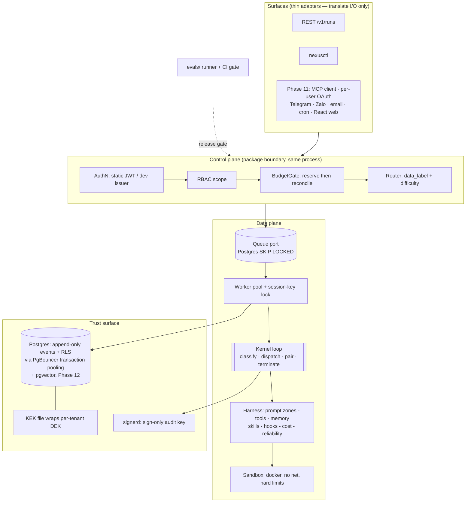

# Nexus Agent Demo

A **simplified, single-binary Go reimplementation** of
[`truongpx396/nexus-agent`](https://github.com/truongpx396/nexus-agent) that still exercises **every core pattern** of the original design.

**Target**: Go, one binary (`nexusd`) + one CLI (`nexusctl`), Postgres + PgBouncer + Redis,
Docker-based sandbox. ~14 phases, ~8–11 weeks solo at a steady pace, every phase shippable.

---

## 1. What the original is, in one page

Two governing equations drive everything:

```
Reliability      ≈ Model capability × Harness quality      (harness ≈ 80% of quality)
Enterprise-ready ≈ Harness quality  × Trust surface        (security + governance + observability)
```

Five architectural strata, connected by hard contracts:

| Stratum | Job | Non-negotiable property |
|---|---|---|
| **Surfaces** | CLI / REST / chat / web / email / cron / Telegram / Zalo / agent-ingress | Thin translators. Zero control flow. Declare a capability descriptor. |
| **Control plane** | AuthN (per-tenant OIDC), RBAC, rate limits, budgets, routing | Deterministic, auditable. Separately deployable behind a versioned contract. |
| **Data plane** | Durable queue → stateless worker → kernel loop → harness → sandbox | All state externalized. Can move into a customer VPC by configuration. |
| **Kernel** | `observe → think → act`, one async generator | Typed response classification; typed terminal reason; paired `tool_use`/`tool_result`. |
| **Trust surface** | RLS, vault, envelope encryption, hash-chained audit, content-free telemetry, approval, sandbox, Rule of Two | Day-one, co-equal perimeter controls — never a retrofit. |

The nine constitutional principles, compressed:

1. **One loop, many surfaces** — no per-surface control-flow fork.
2. **Immutable models, append-only state** — the event log is the only mutable runtime state.
3. **Cache-stable context is architecture** — byte-stable prefix + volatile tail, >90% cache-read.
4. **Stop on cost, not vibes** — pre-spend reservation, hard ceilings, `cost_exhausted`.
5. **Safety is per-invocation and fails closed** — parsed input, layered defense, Rule of Two.
6. **Tenant first; audit + observability day one** — RLS with transaction-local scope, hash-chained receipts, content-free telemetry.
7. **Model/provider-agnostic by abstraction** — one provider port, native tool calling, deterministic routing.
8. **Classify, resume, never silently retry** — typed failure classes, durable checkpoints, circuit break.
9. **Verify against acceptance criteria; govern every change** — evals as the release gate, before the first behavior-bearing slice.

---

## 2. The simplification thesis

The original's own MVP cut line states the rule this plan inherits verbatim:

> **Seams and schema decisions are made early because they are expensive to retrofit;
> infrastructure is added late because it is cheap to add and expensive to carry.**

So the demo keeps **every seam, every contract, and every control**, and collapses only
**deployment topology, scale-out infrastructure, and the commercial/compliance tail**.

Concretely, three collapses:

| Collapse | Original | Demo | Why it's honest |
|---|---|---|---|
| **Deployment** | 3 Go binaries (`control-plane`, `runtime-worker`, `surface-gateway`) + Python helper + React app | 1 binary `nexusd` (+ `nexusctl` CLI, + `signerd` for key custody) | The control↔data-plane split stays a **Go interface** (`controlplane.Port`) with a versioned request/response shape, and the packages never import across the boundary. Splitting into processes later is a `main.go` change, not a rewrite. |
| **Infrastructure** | NATS JetStream, gVisor/Kata warm pool, S3, KMS/HSM, external vault, PgBouncer, OTel collector, pgvector | Postgres (queue via `SKIP LOCKED`), Docker sandbox (no warm pool), local blob dir, file-backed KEK + `signerd`, PgBouncer (kept — it's load-bearing), stdout OTLP | Each sits behind a port with one adapter. The original's own cut line defers exactly these. **PgBouncer is kept** because the transaction-local RLS rule is meaningless without a transaction pooler to prove it against. |
| **Commercial + compliance tail** | Credit ledger, billing periods, FX, price overrides, multi-region residency, BYOK, chargeback export, MCP/OAuth connectors, Telegram/Zalo, document conversion, retrieval tier, adversarial scan, adaptation proposals | Dropped (columns kept where they're schema seams) | These are business processes, not patterns. Dropping them removes ~60 of 191 FRs and zero architectural ideas. |

Everything else — the kernel, the pipeline, the permission chain, the approval transaction,
the audit chain, the erasure model, the cost gate, the orchestration plane, delegation,
the eval gate — ships **in full**, because each *is* the pattern.

The full pattern-by-pattern fidelity scoring (67 rows) and the phase-by-phase build plan
(Phase 0 through Phase 13) live in [`docs/build-phases.md`](docs/build-phases.md) — split out
to keep this narrative readable. Score: 57 of 67 patterns at full or simplified fidelity, 4 as
seams, 6 deliberately out of scope; Phase 13 (added after
[`docs/production-readiness-review.md`](docs/production-readiness-review.md)) closes gaps
between what several **F**-rated patterns claimed and what the shipped code did, without
changing that score.

---

## 3. Target architecture of the demo



### Repository layout

```text
nexus-agent-demo/
├── cmd/
│   ├── nexusd/                 # the single binary: control plane + worker pool + REST surface
│   ├── nexusctl/               # CLI surface adapter — the second surface that proves Principle I
│   └── signerd/                # sign-only audit-chain key custody over a unix socket
├── kernel/                     # THE LOOP — no imports from internal/surfaces or internal/controlplane
│   ├── loop.go                 # iter.Seq2[Event,error] generator; the only control flow in the system
│   ├── classify.go             # TOOL_CALLS | CONTENT | EMPTY
│   ├── terminal.go             # the 8 typed terminal reasons + their producers
│   └── hygiene.go              # pre-call pass: orphan drop, synthetic backfill, stale prune
├── internal/
│   ├── provider/               # port + normalized stream + anthropic/ + fake/ + router + failover
│   ├── tools/                  # identity, manifest, admission, registry, pipeline (16 steps), builtin/
│   ├── permissions/            # the 10-layer chain, autonomy ratchet, profiles, safety/, ruleoftwo
│   ├── hooks/                  # dispatcher + command|http|prompt handlers + bounding guards
│   ├── oversight/              # approvals + input requests over one durable-suspend mechanism
│   ├── promptctx/              # two-zone builder, cache measurement, pruning, condensation
│   ├── memory/                 # file-first, screening, retention
│   ├── skills/                 # bundles, digests, 3-tier disclosure, capability intersection
│   ├── cost/                   # money, meters, price book, reserve/reconcile, budget decisions
│   ├── audit/                  # chain builder, signer client, verifier, anchor
│   ├── crypto/                 # KEK/DEK envelope, seal/open, shred, derived-artifact reconcile
│   ├── store/                  # events, projections, checkpoints, snapshots, claims, RLS scoping
│   ├── queue/                  # Queue port + postgres adapter + session-key lock
│   ├── reliability/            # classifier, backoff, breaker, stuck detector
│   ├── runctl/                 # steer, cancel, resume, replay, fork, tightenAutonomy
│   ├── sandbox/                # docker exec, limits, deny-net, (optional) broker
│   ├── plan/                   # orchestration plane: schema, validator, predicate AST, evaluator
│   ├── delegate/               # sub-agent seam (a tool invocation, not a side channel)
│   ├── surfaces/               # rest/, cli/, telegram/, zalo/, email/, cron/, mcp/ — Phase 11 adds the last five
│   ├── connectors/             # Phase 11: per-user OAuth token vault, sealed under crypto/
│   ├── retrieval/              # Phase 12: pgvector index, tenant-scoped like every other table
│   ├── ingest/                 # Phase 12: document conversion — PDF/DOCX/HTML → scanned, digested chunks
│   ├── obs/                    # allowlisted attributes, log-derived spans, content-access grants
│   ├── harness/                # harness_digest computation
│   ├── config/                 # tenant/agent/profile/policy loading — config, never forks
│   └── controlplane/           # the versioned CP<->DP contract as Go interfaces + local impl
├── web/                        # Phase 11: React app over the existing REST + SSE API — no backend surface change
├── migrations/                 # numbered SQL, expand/contract discipline, RLS policies
├── evals/                      # corpus/*.yaml, runner, graders, judge, digest, CI gate
├── deploy/
│   ├── docker-compose.yml      # postgres, pgbouncer(:6432, transaction pooling), redis
│   └── sandbox/Dockerfile      # the hardened exec image
├── tests/
│   ├── contract/               # kernel ABI, control/data-plane, run-API
│   ├── integration/            # isolation-through-pooler, resume, ceiling, HITL, erasure
│   └── property/               # paired-result invariant over generated histories
├── docs/                       # design notes; diagrams mirrored from the source repo
└── PLAN.md                     # this file
```

**Import boundary rule (enforced by a test, not a convention):**
`kernel/` may import `internal/{provider,tools,promptctx,store,cost,reliability,obs}` and nothing else.
`internal/surfaces/` may not import `kernel/`. `internal/controlplane/` may not import
`internal/{sandbox,memory,provider}`. A `tests/contract/boundaries_test.go` walks the import
graph with `go/packages` and fails the build on a violation — this is what keeps the
"physical split later is a deployment change" claim true.

### Core schema (the part that cannot be retrofitted)

```sql
-- Every tenant-scoped table carries tenant_id and an RLS policy. No exceptions.
CREATE TABLE events (
  event_id        uuid PRIMARY KEY,
  session_id      uuid NOT NULL,
  tenant_id       uuid NOT NULL,
  seq             bigint NOT NULL,
  schema_version  int  NOT NULL,             -- envelope version; upcasting path documented
  type            text NOT NULL,             -- the ~40-type taxonomy
  payload         bytea,                     -- AES-256-GCM ciphertext under the tenant DEK
  payload_digest  bytea NOT NULL,            -- over PLAINTEXT; survives crypto-shredding
  key_id          text NOT NULL,             -- destroying this key IS erasure
  actor           text NOT NULL,             -- model | tool | user | system
  tool_id         text,                      -- {namespace}/{name}@{version}
  pair_ref        uuid,                      -- tool_result -> tool_use  (THE invariant)
  model_id        text,
  trace_id        bytea, span_id bytea,      -- the bidirectional join key
  created_at      timestamptz NOT NULL DEFAULT now(),
  UNIQUE (session_id, seq)
);
ALTER TABLE events ENABLE ROW LEVEL SECURITY;
CREATE POLICY events_tenant ON events
  USING (tenant_id = current_setting('app.tenant_id', true)::uuid);
-- events are append-only: no UPDATE/DELETE grant to the app role, enforced by a trigger too.

CREATE TABLE sessions (
  session_id uuid PRIMARY KEY, session_key text NOT NULL, tenant_id uuid NOT NULL,
  surface_id text NOT NULL, user_id uuid NOT NULL, audience_ref text,
  agent_id uuid NOT NULL, agent_version int NOT NULL,        -- pinned at run start
  harness_digest bytea NOT NULL,                             -- pins ALL behavior-bearing config
  forked_from_session_id uuid, fork_seq bigint, fork_overrides jsonb,
  data_label text NOT NULL, route_model_id text NOT NULL, route_reason jsonb NOT NULL,
  execution_class text NOT NULL, priority int NOT NULL, region text NOT NULL,
  parent_session_id uuid, root_session_id uuid NOT NULL, depth int NOT NULL DEFAULT 0,
  delegation_role text NOT NULL DEFAULT 'root',
  plan_id uuid, plan_version int,
  taint_state jsonb NOT NULL,        -- PROJECTION
  status text NOT NULL,              -- PROJECTION
  autonomy_level text NOT NULL,      -- pinned, ratcheting
  terminal_reason text,              -- PROJECTION
  active_ms bigint NOT NULL DEFAULT 0, suspended_ms bigint NOT NULL DEFAULT 0,
  created_at timestamptz NOT NULL DEFAULT now()
);
```

Plus, all with `tenant_id` + RLS: `checkpoints`, `snapshots`, `idempotency_claims`,
`approvals`, `input_requests`, `audit_receipts`, `audit_anchors`, `encryption_keys`,
`cost_records`, `budgets`, `budget_reservations`, `budget_decisions`, `price_book`,
`tools`, `tool_profiles`, `catalog_manifests`, `effect_classes`, `approval_policies`,
`skills`, `skill_bundle_files`, `memories`, `derived_artifacts`, `sandboxes`,
`surfaces`, `surface_identities`, `delivery_records`, `delegations`,
`orchestration_plans`, `content_access_grants`, `queue_jobs`.

~32 tables. The original has ~50; the 18 dropped are billing, FX, connectors, integration
adapters, and the eval entities (which live in `evals/` as files here, not rows).

Phases 11–12 add their own tables when they ship — `oauth_tokens` (`tenant_id`, `user_id`,
`provider`, sealed under the same per-tenant DEK as any encrypted payload) and
`retrieval_chunks` (`tenant_id`, `doc_id`, `chunk_id`, `embedding`, `source_digest`) — both
`tenant_id`-scoped and RLS-enabled like every table above; nothing about them changes the Phase 1
schema, which is the whole point of adding them late.

**Tenant scoping — the only sanctioned form:**

```go
// internal/store/tenant.go — every read/write path goes through this. No exceptions.
func (s *Store) InTenantTx(ctx context.Context, tenantID uuid.UUID, fn func(pgx.Tx) error) error {
    return pgx.BeginFunc(ctx, s.pool, func(tx pgx.Tx) error {
        // transaction-local, parameterised. SET LOCAL cannot take a parameter; set_config(.., true) can.
        if _, err := tx.Exec(ctx, `SELECT set_config('app.tenant_id', $1, true)`, tenantID.String()); err != nil {
            return err
        }
        return fn(tx)
    })
}
```

Session-level `SET` is banned by a lint rule *and* by the isolation test running through
PgBouncer in transaction-pooling mode — the whole point being that a connection is
reassigned between tenants between statements.

### Key interfaces (the kernel ABI, translated to Go)

```go
// kernel/loop.go — the generator. This is the ONLY place control flow lives.
type Kernel interface {
    Run(ctx context.Context, s *Session) iter.Seq2[Event, error]
}

// internal/provider — one abstraction, native tool calling only, usage split by class.
type Provider interface {
    Stream(ctx context.Context, p Prompt, tools []ToolSchema, rc RunContext) (Stream, error)
}
type Chunk struct {
    Kind      ChunkKind // content | reasoning | tool_use | usage | done
    Text      string
    Opaque    []byte    // reasoning: round-tripped, never shown
    ToolUseID, ToolName string
    Input     json.RawMessage
    Usage     Usage     // InputUncached, InputCacheRead, InputCacheWrite, Output
    Done      DoneReason // stop | max_output | error
}

// internal/tools — self-describing; every field of Taint defaults to TRUE.
type Tool interface {
    ID() ToolRef                         // {namespace}/{name}@{version}
    Descriptor() Descriptor              // description, schemas, digest, disclosure, effect class
    Taint() Taint                        // returns_untrusted, reads_private_data, mutates_external
    IsConcurrencySafe(input json.RawMessage) bool   // PER INVOCATION, default false
    CheckPermissions(ctx context.Context, in json.RawMessage, rc RunContext) PermissionResult
    ValidateInput(ctx context.Context, in json.RawMessage, rc RunContext) error
    Call(ctx context.Context, in json.RawMessage, rc RunContext) (Result, error)
}

// internal/cost — called BEFORE every Provider.Stream, including auxiliary calls.
type BudgetGate interface {
    Reserve(ctx context.Context, r ReserveReq) (Reservation, error) // -> cost_exhausted on refusal
    Reconcile(ctx context.Context, id ReservationID, u Usage) error // accepts UNREPORTED
    Record(ctx context.Context, m MeterID, qty int64, ref string) error
}

// internal/oversight — approval and elicitation share suspension and nothing else.
type Oversight interface {
    RequestApproval(ctx context.Context, r ApprovalRequest, rc RunContext) (ApprovalOutcome, error)
    RequestInput(ctx context.Context, r InputRequest, rc RunContext) (InputOutcome, error)
    Invalidate(ctx context.Context, sessionID uuid.UUID, reason InvalidationReason) error
}

// internal/store — one log, three artifacts that are never interchangeable.
type Persistence interface {
    Append(ctx context.Context, e Event) (Seq, error)
    Checkpoint(ctx context.Context, sessionID uuid.UUID) (CheckpointID, error) // machine-facing resume
    Snapshot(ctx context.Context, sessionID uuid.UUID, at Seq) (SnapshotID, error) // disposable
    Hydrate(ctx context.Context, sessionID uuid.UUID) (SessionState, error)
    Claim(ctx context.Context, key string, pairRef uuid.UUID) (Claim, error)  // WRITE-AHEAD
    ResolveClaim(ctx context.Context, id ClaimID, r Resolution) error         // never re-executes
}

// internal/controlplane — the versioned boundary. One process today, two later.
type Port interface { // v1
    AdmitRun(context.Context, AdmitRunV1) (AdmitRunResultV1, error)
    ReserveBudget(context.Context, ReserveBudgetV1) (ReserveBudgetResultV1, error)
    ReportCost(context.Context, ReportCostV1) error
    EmitAuditReceipt(context.Context, EmitAuditReceiptV1) error
    RequestApproval(context.Context, RequestApprovalV1) (RequestApprovalResultV1, error)
    AuthorizeContentAccess(context.Context, AuthorizeContentAccessV1) (GrantV1, error)
}
```

### The permission chain, verbatim from the original

```go
// internal/permissions/chain.go — one published TOTAL order. Every invocation walks it.
//  1  Deny rules (tenant/tool/pattern)  -> DENY (final)
//  2  PreToolUse hooks                  -> DENY (final) | ASK | DEFER      (never ALLOW)
//  3  Autonomy level (pinned, ratchet)  -> DENY | ASK | DEFER
//  4  Gate 1: tool profile membership   -> DENY | DEFER                    (never ALLOW)
//  5  Gate 2: capability metadata       -> DENY | ASK | DEFER
//  6  Gate 3: per-invocation safety     -> DENY | ASK | DEFER   ALWAYS EVALUATED
//  7  Rule of Two (taint + declaration) -> ASK  | DEFER          ALWAYS EVALUATED
//  8  Approval policy                   -> AUTO | ASK(once|session|multi_party)
//  9  Standing scope / batch / preauth  -> SATISFIES an ASK      (never suppresses one)
// 10  Otherwise                         -> ALLOW
//
// Two invariants make the order load-bearing rather than decorative:
//   - a DENY at any layer is final; there is no bypass mode in this system.
//   - layers 6 and 7 are unconditional; a remembered "yes" answers a question,
//     it never grants permission to stop asking it.
// Skills sit BELOW this table as an intersection pre-filter, never as a layer —
// a layer could resolve ALLOW, and "load this skill" must never widen anything.
```

---

## 4. Testing strategy

| Layer | What | Where |
|---|---|---|
| **Property** | The paired-result invariant over *generated* histories — it is a total invariant, so examples are not enough | `tests/property/` |
| **Deterministic** | All correctness tests run against `provider/fake` — they never flake and never bill | everywhere |
| **Contract** | Kernel ABI, control↔data-plane `v1`, run-API OpenAPI, import boundaries | `tests/contract/` |
| **Integration** | Isolation **through PgBouncer**, resume-from-checkpoint, concurrent ceiling, approval transaction, erasure-then-verify | `tests/integration/` |
| **Adversarial** | Consent suppression/simulation, mid-run autonomy widening, standing-scope escape, descriptor swap after admission, skill capability widening | `evals/corpus/safety/` |
| **Eval gate** | The only place live models are called; governed by trial statistics rather than determinism | `evals/` |

Two rules carried over verbatim from the original, because they are what make the rest mean anything:

1. **The eval gate ships in Phase 1**, before the first behavior-bearing slice — the window in
   which changes have the largest effect sizes is otherwise the window in which they go unmeasured.
2. **Correctness tests never call a live model.** A non-deterministic dependency gets a
   deterministic harness, or the suite measures the weather.

## 5. Explicitly out of scope (and the trigger that would change that)

Same discipline as the original's cut line — each is additive against the Phase 1 schema, so
none requires migrating the event log, the audit chain, or the encryption model.

| Deferred | Trigger |
|---|---|
| NATS JetStream; multi-process worker pool | Concurrency exceeds one process's comfortable load |
| gVisor/Kata runtime classes, warm sandbox pool | Hostile multi-tenant isolation is required (the image and limits are already identical; it is a `runtimeClassName` change) |
| **Physical** control/data-plane split | A BYOC customer exists — the contract and package boundary already ship |
| Credit ledger, billing periods, FX, price overrides, chargeback export | The platform bills someone |
| Multi-region residency, BYOK, Helm/Terraform, rainbow deploy | A tenant contract requires it; `region` and `key_id` are already columns |
| Third-party integration adapters (LiteLLM, Langfuse, Temporal…) | One is actually wanted; the ports exist and the platform must keep working with all of them off |
| Scheduled adversarial discovery, in-boundary online scorer, adaptation proposals | Production traffic exists to mine |
| In-sandbox broker | The token savings of in-sandbox orchestration are actually needed. **Until then connectors stay in the sandbox egress deny set** — a bypass is never the interim state |

## 6. Source references

Read alongside this plan (all in `truongpx396/nexus-agent@2ad2a6a`):

| Document | Why |
|---|---|
| `.specify/memory/constitution.md` | The nine principles. Every design decision here maps to one; it is also the code-review checklist. |
| `specs/001-agent-platform/contracts/kernel-abi.md` | The interface seams translated in §3 — Provider, Tool, Delegation, Memory, Workspace, Surface, Skills, RunControl, Oversight, BudgetGate, Persistence, Telemetry. |
| `specs/001-agent-platform/contracts/tool-contract.md` | The 16-step pipeline and the 10-layer resolution order, verbatim. |
| `specs/001-agent-platform/contracts/orchestration-plane.md` | Plan schema, lifecycle gates, zero-token routing invariant. |
| `specs/001-agent-platform/data-model.md` | Entity fields; the demo's schema is a subset with identical column semantics. |
| `specs/001-agent-platform/plan.md` § MVP cut line | The seams-early/infrastructure-late rule this whole plan inherits. |
| `specs/001-agent-platform/quickstart.md` | The nine validation scenarios; `docs/build-phases.md`'s demo commands are their simplified analogues. |

This repo's own supplementary docs:

| Document | Why |
|---|---|
| [`docs/build-phases.md`](docs/build-phases.md) | The pattern coverage map, the full build plan (Phase 0 through Phase 13), the effort estimate, and the risk register — split out of this file, linked from §2. |
| [`docs/production-readiness-review.md`](docs/production-readiness-review.md) | The audit that found F1–F15 and drove Phase 13. |
| [`docs/constitution.md`](docs/constitution.md) | The nine principles, copied in verbatim (Phase 0, task 0.6) as the review checklist. |
| [`docs/go-live.md`](docs/go-live.md) | The go-live checklist and what `nexusd go-live` automates versus what stays a manual review. |
