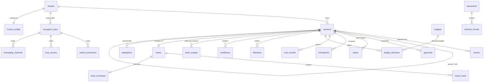

# Data Model: Nexus Agent Platform (baseline)

**Plan**: [plan.md](plan.md) | **Spec**: [spec.md](spec.md) | **Source of truth**: `migrations/0000`–`0024` (embedded; applied in
filename order; expand-only — a rollback is a new later migration).

32 tables. **Every one** has row-level security enabled **and forced** (33 `FORCE` statements across the migrations; one is
the since-dropped `queue_jobs`), keyed on `current_setting('app.tenant_id', true)::uuid`. Runtime connects as `nexus_app`
(`NOSUPERUSER NOBYPASSRLS`) through PgBouncer; only `nexus` (superuser, direct) runs migrations. See research R-03, R-04.

> README §3 lists ~31 tables including `tools`, `tool_profiles`, `catalog_manifests`, `memories`, `skills`,
> `skill_bundle_files`, `surfaces` and `surface_identities`. **None of those exist** — tools, skills and memory are code and
> files, and tool profiles live in code/config. This document follows the migrations.

## Cross-cutting rules

1. **Tenant first.** Every table except `tenants` carries `tenant_id uuid NOT NULL REFERENCES tenants`. (`tenants` is RLS'd
   against its own primary key.) `tenant_id` is the leading column of every tenant-scoped index.
2. **The log is the only source of truth.** `events` is append-only; columns marked **PROJECTION** are derived by replay
   and written in the *same transaction* as the event that justifies them (`store.UpdateSessionStatus`).
   `store.ReplayProjection` rebuilds status structurally (no decrypt); `ReplayFullProjection` adds one selective decrypt for
   the exact terminal reason. A test asserts rebuilt == stored.
3. **Money is integer minor units** (`*_micros bigint`, `minor_units bigint`) with an explicit `currency`. No float column
   exists anywhere in the schema.
4. **Digests are over plaintext** and survive crypto-shredding (`payload_digest`, `canonical_digest`, `source_digest`).
5. **Sealed columns** (`payload`, `sealed_*`) are ciphertext under a per-tenant DEK identified by `key_id`.
6. **Seams before behavior.** Several `sessions` columns (`agent_id`, `plan_id`, the delegation-chain columns, `region`) were
   added in Phase 1 and populated only when their phase landed — retrofitting a column onto historical rows is the migration
   an append-only log exists to avoid.

## Entity-relationship overview

## 1. Identity and isolation

### `tenants`
| Column | Type | Notes |
|---|---|---|
| `tenant_id` | uuid PK | |
| `name` | text NOT NULL | |
| `region` | text NOT NULL default `'local'` | seam; residency is out of scope |
| `data_label_default` | text NOT NULL default `'internal'` | feeds routing |
| `created_at` | timestamptz | |

### `tenant_configs` (PK `tenant_id`)
`admitted_skill_ids jsonb` (default `[]`), `memory_retention_days int` (default **90**), `admitted_connector_providers jsonb`
(default `[]`, added `0018`), `updated_at`. Config, not forks: per-organization behavior is data read at runtime.

### `encryption_keys`
`key_id uuid PK`, `tenant_id`, `wrapped_dek bytea NOT NULL`, `status text` (default `'active'`), `created_at`,
`shredded_at timestamptz`. **Destroying a row's usable key *is* erasure.**

## 2. The run and its log

### `sessions` (the run record)
| Group | Columns |
|---|---|
| Identity | `session_id` PK, `session_key text` (indexed with `tenant_id`; deterministic per-peer key for messaging), `tenant_id`, `surface_id`, `user_id`, `audience_ref` |
| Pinned config | `agent_id`, `agent_version`, **`harness_digest bytea NOT NULL`** (never changes mid-run) |
| Fork | `forked_from_session_id` FK self, `fork_seq bigint`, `fork_overrides jsonb` |
| Routing | `data_label` (default `internal`), `route_model_id`, `route_reason jsonb` |
| Scheduling | `execution_class` (default `interactive`), `priority int`, `region` |
| Lineage | `parent_session_id` FK self, `root_session_id NOT NULL`, `depth int` (default 0), `delegation_role` (default `root`; `team_member` for team members) |
| Plan / team | `plan_id`, `plan_version`, `team_id` FK `teams` (nullable, `0017`) |
| Governance | `autonomy_level text` (default `supervised`; a one-way ratchet) |
| **PROJECTION** | `status`, `terminal_reason`, `taint_state jsonb`, `active_ms`, `suspended_ms` |
| Conversational | `conversational boolean` (default false), `updated_at` (idle sweep signal), both `0023` |

**Status** values: `queued` (schema default) → `running` ⇄ `suspended` (a specific tool_use awaits a human) /
`awaiting_input` (conversational pause) → `completed` | `failed`. The terminal *reason* lives in `terminal_reason`; the
status is `completed` only for reason `completed`, and `failed` for every other reason (including `aborted`).

**Terminal reasons** (10): `completed`, `max_turns_exceeded`, `cost_exhausted`, `aborted`, `stuck_terminated`,
`permission_denied`, `context_overflow`, `error`, `refused`, `idle_timeout`.

**Indexes**: `(tenant_id, session_key)`, `(root_session_id)`, partial `(team_id)`, partial `(updated_at) WHERE status =
'awaiting_input'`.

### `events` (append-only)
| Column | Type | Notes |
|---|---|---|
| `event_id` | uuid PK | |
| `session_id` | uuid FK | `UNIQUE (session_id, seq)` — seq is strictly sequential per session |
| `tenant_id`, `seq bigint`, `schema_version int`, `type text` | | upcast registry keeps old versions replayable |
| `payload bytea` | | ciphertext under `key_id` |
| `payload_digest bytea NOT NULL` | | over **plaintext**; survives shredding |
| `key_id text NOT NULL` | | |
| `actor text NOT NULL` | | `model` \| `tool` \| `user` \| `system` |
| `tool_id`, `model_id` | text | |
| `pair_ref uuid` | | `tool_result → tool_use`; partial index — **the paired-result invariant** |
| `trace_id`, `span_id` | bytea | bidirectional join to telemetry |

**Immutability**: `events_forbid_mutation` trigger (every role, including owner) **and** `REVOKE UPDATE, DELETE FROM nexus_app`.
Event types: see [contracts/event-taxonomy.md](contracts/event-taxonomy.md) (60).

## 3. Cost governance

| Table | Key columns | Rules |
|---|---|---|
| `price_book` | `price_book_id` PK; `meter`, `subject` (default `'*'`), `version`, `currency`, `price_micros_per_million bigint`, `effective_from`, `effective_until` | `UNIQUE (tenant_id, meter, subject, version)`; index `(tenant_id, meter, subject, effective_from)`; history stays reproducible (FR-045) |
| `budgets` | `budget_id` PK; `scope`, `scope_ref → sessions`, `currency`, `ceiling_micros`, **`epoch bigint`** (default 1) | `CHECK scope IN ('tenant','session')`; `CHECK (scope='tenant') = (scope_ref IS NULL)`; unique tenant ceiling per tenant, unique session ceiling per session |
| `budget_decisions` | `session_id`, `decision`, `reason`, `budget_id → budgets`, `reserved_micros`, `currency` | `CHECK decision IN ('allow','refuse_ceiling','degrade','skip')` — every gate resolution is recorded, so an unenforced ceiling differs from one with room |
| `cost_records` | `session_id`, `reservation_id`, `meter`, `quantity`, `unit`, `minor_units`, `currency`, `model_id`, **`unreported boolean`** | `unreported` = reconciled at full reserved worst case (FR-049) |

Shared **Redis** state (not in Postgres): the atomic per-tenant spend counter and its epoch marker. Unknown epoch ⇒ fail closed.

## 4. Trust: audit, oversight, content access, sandbox

| Table | Key columns | Rules |
|---|---|---|
| `audit_receipts` | `receipt_id` PK, `receipt_seq bigserial` (global), `session_id`, `seq`, `event_id`, `event_type`, `payload_digest`, `prev_hash`, `hash`, `signature`, `signer_key_id` | `UNIQUE (session_id, seq)`; **chain per session**; over *digests* so redaction never breaks verification |
| `audit_anchors` | `from_receipt_seq`, `to_receipt_seq`, `hash`, `signature`, `signer_key_id` | periodic head commitment outside the writing system; verifier alerts on a break or gap |
| `approvals` | `tool_use_event_id`, `tool_id`, `ask_kind`, **`canonical_digest`**, `context_package jsonb`, `assignee`, `status`, `granted_input jsonb`, `expires_at`, `decided_at`, `decided_by`, `reason` | `CHECK status IN ('pending','granted','granted_modified','denied','expired','invalidated')`; partial index on `pending` |
| `input_requests` | `question`, `schema jsonb`, `on_expiry`, `default_assumption jsonb`, `status`, `answer jsonb`, `used_default`, `expires_at` | `CHECK status IN ('pending','answered','expired','invalidated')`; `CHECK on_expiry IN ('expire','default')` — carries **zero** authorization |
| `content_access_grants` | `session_id`, `grantee_id`, `reason`, `expires_at`, `revoked_at` | the only path to plaintext outside the run's audience; receipt on grant and every read |
| `derived_artifacts` | `session_id`, `kind`, `path`, `deleted_at` | blob spills, etc.; **hard-deleted in the erasure transaction**; reconciliation proves none survives |
| `sandboxes` | `session_id`, `container_id`, `isolation`, `status`, `breach_reason`, `reclaimed_at` | `CHECK isolation IN ('docker','gvisor','kata')` (only `docker` ships; OpenSandbox is selected by config, not by this column); `CHECK status IN ('active','reclaimed','breached')` |

**Approval state machine**: `pending → granted | granted_modified | denied | expired | invalidated`. Terminal states are
final. `granted_modified` executes the approver's `granted_input`. `expired` denies the *action*, not necessarily the run.
`invalidated` is produced by cancel, terminal, reap, ceiling breach, or steer-into-suspension.

**Input-request state machine**: `pending → answered | expired | invalidated`; on `expire`, `on_expiry='default'` records a
default assumption (`used_default=true`) instead of `input_expired`.

## 5. Reliability: the three state artifacts

| Table | Key columns | Rules |
|---|---|---|
| `claims` | `tool_id`, `canonical_digest`, `status`, `reason`, `resolved_at` | `CHECK status IN ('in_flight','completed','abandoned')`; `UNIQUE (session_id, canonical_digest)`; **written `in_flight` before the effect leaves the process**; partial index on `in_flight` |
| `checkpoints` | `covered_seq`, `open_claim_id`, `held_reservation_id`, `sandbox_handle`, `pending_approval_digest`, `provider_request_id`, `open_delegations jsonb`, `harness_digest` | machine-facing resume artifact; latest per session |
| `snapshots` | `at_seq`, `status`, `terminal_reason` | **disposable** cache; deleting all changes nothing but hydration time |
| *(condensation)* | an event (`condensation`), not a table | model-facing only; cannot answer whether an effect completed |

**Claim state machine**: `in_flight → completed | abandoned`. A claim found `in_flight` on resume is resolved by probe or human,
**never by re-execution**.

The job queue is **Redis Streams** (consumer group + `XAUTOCLAIM`); `queue_jobs` (`0011`) was dropped by `0024`.

## 6. Delivery and surfaces

| Table | Key columns | Rules |
|---|---|---|
| `deliveries` | `session_id`, `seq`, `surface_id`, `recipient`, `status`, `attempt_count`, `delivered_at` | `UNIQUE (session_id, seq, surface_id, recipient)` (idempotency); `CHECK status IN ('pending','delivered','failed','failed_permanent','suppressed')`; event appended **before** send |
| `messaging_channels` | `kind`, `sealed_credential`, `key_id`, `webhook_secret`, `config jsonb`, `status` | `UNIQUE (tenant_id, kind)`; `CHECK kind IN ('telegram','zalo','email_smtp')`; `CHECK status IN ('active','disabled')` |
| `cron_schedules` | `user_id`, `name`, `cron_expr`, `input`, `autonomy_level`, `budget_ceiling_micros`, `enabled`, `last_run_at`, `next_run_at` | `UNIQUE (tenant_id, name)`; `CHECK autonomy_level IN ('read_only','supervised','autonomous')`; partial index on due schedules |
| `mcp_servers` | `name`, `base_url`, `auth_kind`, `sealed_static_token`, `key_id`, `oauth_provider`, `status` | `UNIQUE (tenant_id, name)`; `CHECK auth_kind IN ('none','bearer_static','oauth_connector')`; `CHECK status IN ('pending','admitted','disabled')` |
| `oauth_connections` | `user_id`, `provider`, `sealed_access_token`, `sealed_refresh_token`, `key_id`, `scope`, `expires_at` | `UNIQUE (tenant_id, user_id, provider)`; tokens readable **only inside a tool's call** |

## 7. Orchestration, delegation, teams

| Table | Key columns | Rules |
|---|---|---|
| `orchestration_plans` | PK **`(plan_id, version)`**; `name`, `spec jsonb`, `status`, `agent_version`, `route_model_id`, `created_by`, `signed_off_by`, `enabled_at` | `CHECK status IN ('draft','validated','eval_passed','signed_off','enabled','retired')`; **immutable once `enabled`**; `agent_version`+`route_model_id` pinned at enable |
| `delegations` | `parent_session_id`, `child_session_id`, `parent_tool_use_event_id`, `fanout_id`, `agent_id`, `task`, `scope_grant jsonb`, `return_schema jsonb`, `status`, `result jsonb`, `reason` | `CHECK status IN ('pending','returned','reaped','bound_exceeded')`; bounds: depth ≤ **1**, concurrent (`pending`) ≤ **3**, per-root total ≤ **16** |
| `fanout_envelopes` | `plan_session_id`, `ceiling_micros`, `remaining_micros`, `child_count` | `CHECK remaining_micros >= 0`; `CHECK remaining_micros <= ceiling_micros`; reserved **before the first child** |
| `teams` | `coordinator_session_id`, `roster jsonb` (**fixed at creation**), `envelope_id`, `status`, `reason`, `completed_at` | `CHECK status IN ('active','completed','aborted','ceiling_exhausted')` |
| `board_cards` | `team_id`, `title`, `body`, `status`, `taint_state jsonb` (default `[false,false,false]`), `injection_scan_status`, `scan_findings jsonb`, `written_by_session_id`, `claimed_by_session_id` | `CHECK status IN ('open','claimed','in_progress','done','blocked')`; `CHECK injection_scan_status IN ('pending','clean','flagged')`; a `flagged` card is never surfaced |
| `team_envelopes` | `team_id`, `ceiling_micros`, `remaining_micros`, `member_count` | same two CHECKs as `fanout_envelopes`; reserved once at team creation |

**Plan state machine**: `draft → validated → eval_passed → signed_off → enabled → retired`. In-flight runs finish on the version
they started on.

**Delegation state machine**: `pending → returned | reaped | bound_exceeded` (the last is non-retryable).

**Team state machine**: `active → completed | aborted | ceiling_exhausted`; ending reaps every still-active member. Members
are leaves (`delegation_role = 'team_member'`).

**Card state machine**: `open → claimed → in_progress → done | blocked`.

## 8. Retrieval (pgvector)

| Table | Key columns | Rules |
|---|---|---|
| `documents` | `source_name`, `mime_type`, `source_digest`, `chunk_count`, `admission_status`, `admission_findings jsonb` | `CHECK admission_status IN ('pending','clean','flagged','rejected')`; fail closed before any chunk is indexed |
| `retrieval_chunks` | `doc_id → documents ON DELETE CASCADE`, `chunk_index`, `content`, **`embedding vector(32)`**, `source_digest`, `injection_scan_status` | `UNIQUE (doc_id, chunk_index)`; `CHECK injection_scan_status IN ('clean','flagged','rejected')`; the demo's 32-dimension vector is a deterministic fake embedder's width, **not** a production dimension; deleted in the erasure transaction |

## Validation rules that cross entities

- **Paired results**: every `events` row of type `tool_result` has `pair_ref` → exactly one earlier `tool_use` row in the same
  session; synthetic results are real rows with a reason. (Property-tested over generated histories.)
- **Cost chain**: a model call writes one `budget_decisions` row, then (after the stream) one `cost_records` row; if usage is
  unreported, `unreported = true` and `minor_units` is the full reserved worst case.
- **Lineage**: `root_session_id` is set on every row (equal to `session_id` for a root); `depth ≤ 1`.
- **Erasure**: destroying the tenant's key + hard-deleting `derived_artifacts` and `retrieval_chunks` in one transaction; `events`,
  `payload_digest`s and `audit_receipts` remain, and the chain still verifies.
- **Config pinning**: `sessions.harness_digest` is never updated after insert. `harness.Config` has seven inputs — system-prompt
  version, catalog manifest digest, skill-set digest, **safety policy version**, **approval policy version**, MCP catalog digest
  and prompt mode — but **no non-test caller ever sets the two policy-version fields** (and the REST path hard-codes the
  system-prompt version string `"phase2-v1"`). So today the digest does not move when safety or approval policy changes, which
  FR-010 and the constitution require. Tracked as a Phase 19 task; see spec *Known deviations* 5.
